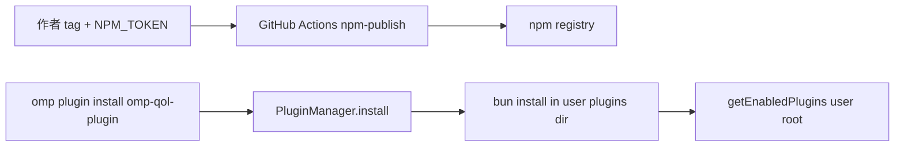
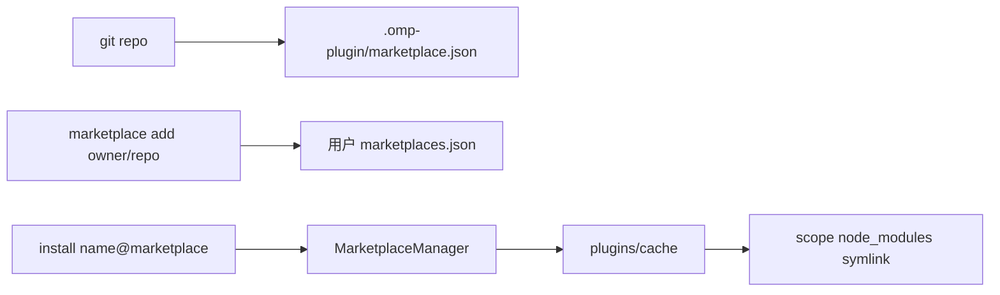
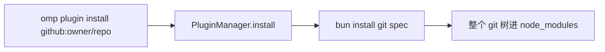

# Tech Clarification Report: omp-qol 用户可安装分发通道（2026-08-15 重做）

**date**: 2026-08-15
**supersedes**: 同日第一版（选 Route B / 仓内 marketplace）。作者否决后按 `impl-route-clarifier` 从零重写。
**requirement input**: 支柱 `docs/ssot/pillars/distribution-delivery/user-installable-plugin.md`（含第二条澄清）；调研 `docs/researches/omp-plugin-packaging-and-distribution-2026-08-15-redo.md`
**accessed**: 2026-08-15

## 1. Requirement Summary

- Source artifact: 分发支柱原文 + 2026-08-15 第二条澄清；重做调研。
- Problem statement: 仓库外用户要能按宿主官方命令安装本插件。上一轮把仓内 catalog 当成发布通道，作者要求重做。
- Success criteria: README 头条是宿主给第三方的真实命令；`plugin/package.json` 能 npm publish；CI 在 push/PR 跑 `bun test` 与插件-only typecheck；tag 上有 publish 作业；本轮不真实 publish；不维护无必要的 marketplace。
- Constraints and assumptions:
  - 插件源码在 `plugin/`，仓库根没有 `package.json`
  - 不改生产 `WATCHDOG.yml`；不给 `test-workspace` 擅自 `git init`；L6 不进默认 CI
  - 仓库 `RatmmmhSquishyRat/omp-qol` 已是 public
  - npm token 由作者稍后提供，**不是**选路条件
  - 宿主 17.3.4：`--scope` 只进入 MarketplaceManager；`PluginManager.install` 只写用户插件根

## 2. Unknowns and Clarifications Needed

| Category | Missing detail | Why it matters | Action |
| --- | --- | --- | --- |
| Product | 作者是否要保留「可选 catalog」给 `--scope project` / 无 npm 的 git 安装 | 决定删还是降级 `.omp-plugin/marketplace.json` | 澄清原文问的是「为什么要维护」。诚实答案是不需要。删除 catalog。 |
| Operations | npm 用 classic token 还是 trusted publisher | 只影响作业认证方式 | 作业同时留 `id-token: write` 与 `NODE_AUTH_TOKEN: ${{ secrets.NPM_TOKEN }}` |
| Operations | 公开包名用 `omp-qol-plugin` 还是 `omp-qol` | 用户打的命令 | 两者 2026-08-15 均 404。沿用已有 `omp-qol-plugin`。 |
| Compliance | 是否投稿 DarkPhilosophy 等社区市场 | 别人的仓 | 不投稿。 |

Blocking unknowns: 无。可以选路。

## 3. Option Map

| Route | Positioning | Time-to-value | Main risks |
| --- | --- | --- | --- |
| A npm 默认 | 一条 `omp plugin install omp-qol-plugin`；tag 作业 publish | 元数据 + CI 本轮可提交；用户命令在第一次 publish 后生效 | 本轮未 publish 时，陌生人执行头条命令会失败，须在 README 写清剩余步骤 |
| B 仓内 marketplace catalog | 上一轮 incumbent。用户 `marketplace add` 再 `install name@marketplace`，`--scope` 可用 | 已实现过，作者否决其作为默认 | 强迫每个用户 add 本仓；维护一份我们不是 catalog 作者的 JSON；`config` 可能找不到市场 symlink |
| C git URL / 根 package.json | `omp plugin install github:owner/repo` | 要先把包挪到仓库根，或接受 bun 把整仓当包 | 根上无 package.json 时这条路不成立；整仓安装会带上 docs / WATCHDOG |

## 4. Community Signals Snapshot

| Component | Discussion intensity rank | Most discussed topics | Community best practices | Evidence |
| --- | --- | --- | --- | --- |
| `omp plugin install <npm-name>` | 1 | 第三方插件头条命令、`npm:` 前缀是否接受、密封二进制加载 TS | 独立作者把插件发到 npm，README 写裸包名 | [omp-notify-tool](https://pi.dev/packages/omp-notify-tool) 2026-08-15；[omp-typescript-complexity-evaluator](https://www.npmjs.com/package/omp-typescript-complexity-evaluator) 2026-08-15；[omp-model-profile](https://github.com/tlarevo/omp-model-profile) 2026-08-15；宿主 `plugin-cli.ts:353` |
| 仓内 / 独立 marketplace.json | 2 | add 源、scope、Claude 兼容路径、catalog 的 npm source 装不上 | **维护目录的人**用；单插件作者把它当可选 | [authoring-marketplaces.md](https://github.com/can1357/oh-my-pi/blob/main/docs/skills/authoring-marketplaces.md) 2026-08-15；[DarkPhilosophy/omp-marketplace](https://github.com/DarkPhilosophy/omp-marketplace) 2026-08-15 |
| `omp plugin install github:user/repo` | 3 | 根清单、#1527 放行 git spec | 适用于根上就是插件包的仓 | [PR #1527](https://github.com/can1357/oh-my-pi/pull/1527) 2026-08-15；omp-model-profile 根清单 |
| GitHub Release tarball 当安装源 | 4 | 几乎无插件安装讨论 | 宿主用 Release 发 omp 二进制 | `classify-install-target.ts` 无 tarball 类型 |

## 5. Dependency Lifecycle Health Snapshot

| Dependency | Route usage | Latest release date | Last meaningful repo activity | Lifecycle status | Evidence | Decision note |
| --- | --- | --- | --- | --- | --- | --- |
| oh-my-pi / omp CLI | 全部 | v17.3.4（本机 `omp --version`） | 2026 持续发版 | active-maintained | https://github.com/can1357/oh-my-pi/releases 2026-08-15 | 安装行为以 17.3.4 源码为准 |
| Bun（`bun install` / 扩展加载） | A, C | 随 omp 发行绑定 | 随 omp | active-maintained | `plugin-manager-installer-plumbing.md` 2026-08-15 | 插件保持 TS 入口 |
| npm registry | A | n/a | n/a | active-maintained | registry.npmjs.org；`omp-qol-plugin` 404 | 主通道；本轮不 publish |
| GitHub marketplace clone | B | n/a | n/a | active-maintained | `marketplace.md` | 不作为默认通道 |
| GitHub Actions `actions/checkout` / `setup-bun` / `setup-node` | A | 2026 仍在发 | 活跃 | active-maintained | 宿主 `.github/workflows/ci.yml` 2026-08-15 | tag 作业仿宿主：OIDC + `NPM_TOKEN` 回退 |

## 6. Route Cards

### Route A: npm 默认

- Core architecture: `plugin/` 作为 npm 包发布；用户 `omp plugin install omp-qol-plugin`
- Stack and versions: npm + `PluginManager.install` + 用户根 `bun install`；omp 17.3.4
- Integration pattern: 用户全局插件根。`--scope` 被忽略并警告。
- Code organization: 保持 `plugin/package.json`；删除仓内 catalog；CI tag 跑 `npm publish`
- Dependency health highlights: npm 与 Bun 均 active-maintained
- Community practice highlights: 宿主例子 `@oh-my-pi/exa`；多个第三方插件头条即 npm

| Dimension | Choice | Tradeoff | Evidence |
| --- | --- | --- | --- |
| Runtime model | 用户根 `bun install` + Bun import TS | 不写项目 `.omp/plugins` | `manager.ts:416-476`；`plugin-cli.ts:429-440` 2026-08-15 |
| Data strategy | 单一身份 `omp-qol-plugin` | 与市场 ID 不再并存 | `handleConfig` 按 `PluginManager.list()` 的 `name` 查找 |
| Deployment model | tag 触发 publish，push/PR 不发 | 本轮无 token 则命令尚未对陌生人可用 | 作者澄清：key 稍后给 |
| Dependency sustainability | npm + Bun + omp | 依赖宿主继续用 `bun install` | plumbing 文档 2026-08-15 |
| Community best practice fit | 独立作者发 npm | 需要一次人工配密钥 | omp-notify-tool / omp-mode-switch 2026-08-15 |

### Route B: 仓内 marketplace catalog（上一轮，现为对照）

- Core architecture: `.omp-plugin/marketplace.json`，`source: "./plugin"`
- Stack and versions: MarketplaceManager + git clone/cp
- Integration pattern: 用户先 add 本仓；`--scope` 生效
- Code organization: 多一套 catalog 版本与包版本对账
- Dependency health highlights: 宿主市场实现仍在维护
- Community practice highlights: 这是 **catalog 作者** 的文档路径

| Dimension | Choice | Tradeoff | Evidence |
| --- | --- | --- | --- |
| Runtime model | 市场缓存 + junction | 用户多一步 add；`config` 可能跳过 symlink | `manager.ts:681-683` 2026-08-15 |
| Data strategy | 市场 ID 与 package name 两套名字 | README 必须解释两套身份 | 上一轮 `omp-qol@omp-qol` vs `omp-qol-plugin` |
| Deployment model | 推 git 即「上架」 | 我们要维护一份不是默认通道的 catalog | 作者：为什么要维护 |
| Community best practice fit | 适合目录仓 | 不适合单插件默认路径 | authoring-marketplaces.md；DarkPhilosophy/omp-marketplace |

### Route C: git URL / 根 package.json

- Core architecture: 让 `github:RatmmmhSquishyRat/omp-qol` 能被 `bun install`
- Stack and versions: 同 PluginManager git spec
- Integration pattern: 仍写用户根；`--scope` 同样被忽略
- Code organization: 根上要有 package.json，或接受整仓当包
- Dependency health highlights: 同 A
- Community practice highlights: 根即插件的仓（omp-model-profile）在用

| Dimension | Choice | Tradeoff | Evidence |
| --- | --- | --- | --- |
| Runtime model | git `bun install` | 当前根无 package.json，命令失败 | `manager.ts:418-423`；本仓布局 |
| Data strategy | 包名仍来自被装树的 package.json | 装错树会带上 docs / WATCHDOG | plumbing git 段 2026-08-15 |
| Deployment model | 推 git 即可 | 和「插件在 plugin/」冲突 | 仓库根现状 |
| Community best practice fit | 根即包时好用 | 本仓不是这种布局 | omp-model-profile README 2026-08-15 |

## 7. Root Divergence Points

| Divergence axis | Route A | Route B | Route C | Impact |
| --- | --- | --- | --- | --- |
| Boundary strategy | 插件身份 = npm 包名 | 插件身份 = name@marketplace，运行时另有 package name | 插件身份 = git 树里的 package.json | A 与 settings/config 对齐 |
| Consistency model | 用户根一份 lockfile | 用户/项目两套市场注册表 + 共享 cache | 同 A | B 独有 project scope |
| Contract ownership | `plugin/package.json` | 再加 catalog 字段与版本对账 | 可能要根 package.json | B/C 增加同步面 |
| Failure handling | 未 publish 则 install 失败 | add 本仓即可装 | 根清单缺失则失败 | A 依赖一次人工密钥 |
| Dependency lifecycle risk | npm + Bun | git clone + 宿主市场 | git + Bun | 均可接受 |
| Community practice alignment | 独立作者默认 | catalog 作者默认 | 根即包的仓 | 作者约束偏向 A |

## 8. Decision Matrix

权重按**本仓库这次的约束**给，不按「通用最佳实践」。project scope 权重压低：作者认为它和 npm 包无关。token 不作为扣分项。

| Criterion | Weight | Route A | Route B | Route C | Notes |
| --- | --- | --- | --- | --- | --- |
| 宿主给第三方的默认命令 | 25 | 10 | 4 | 6 | A 对齐 `@oh-my-pi/exa` / 社区 npm 头条 |
| 不强迫 marketplace add | 20 | 10 | 2 | 10 | 作者第一问 |
| 不维护无必要 catalog | 15 | 10 | 2 | 10 | 删除 B 的核心成本 |
| 身份单一（list/config/upgrade） | 15 | 9 | 4 | 7 | B 的 config 可能跳过市场 symlink |
| 与当前 `plugin/` 布局兼容 | 10 | 10 | 10 | 2 | C 要改根清单 |
| 交付速度（本轮可提交的面） | 10 | 8 | 9 | 4 | B 已经落地过；A 差一次 publish |
| project-scope 安装 | 5 | 2 | 10 | 2 | 保留事实，不拿来选主通道 |
| Weighted total | 100 | 8.85 | 4.35 | 6.30 | A = 25\*10+20\*10+15\*10+15\*9+10\*10+10\*8+5\*2 |

## 9. Recommendation

- Recommended route: **A — npm 默认**
- Why this route wins in this context: 宿主把无 `@` 的 install spec 当 npm；官方例子和多个第三方插件都是一条 `omp plugin install <name>`；作者明确不要为发这一个插件维护 marketplace，也不要用 token 或缺 project scope 否决 npm。
- Explicit tradeoffs accepted:
  - `--scope project` 对这条用户路径无效。保留为宿主事实，不据此改道。
  - 本轮不 publish。头条命令在密钥 + tag 之后才对陌生人成立。README 写清。
  - 不提供仓内 catalog。无 npm 时，开发者 clone 后 `omp plugin install ./plugin`。
- Fallback route and trigger conditions:
  - 若宿主日后让 `PluginManager.install` 接受 scope，A 仍然成立，只需更新帮助文本。
  - 若 npm 发布被注册表策略挡住（名字被抢、账号问题），再评估 C（根 package.json）或临时的可选 catalog。触发条件是发布失败证据，不是「现在没有 token」。

## 10. Implementation Blueprint

- Repository strategy (mono/multi): 保持现有 monorepo。可发布单元是 `plugin/`。
- Module boundaries and ownership:
  - `plugin/package.json`：npm 身份与 `omp.*` 清单
  - `.github/workflows/ci.yml`：push/PR 测试
  - `.github/workflows/release.yml`：tag 上 verify + npm publish + GitHub Release
  - README：用户命令；sandbox 标开发
  - `.omp-plugin/marketplace.json`：删除
- Contract and schema governance: 包名 `omp-qol-plugin`；版本与 git tag `v<version>` 对齐；settings 键与包名相同
- CI/CD and test policy: `bun test` + `bun run typecheck`（`tsconfig.plugin.json`）；L6 不进默认 CI；publish 只在 tag
- Migration and rollback strategy: 已 add 旧 catalog 的用户可继续用旧 clone，直到他们改用 npm。卸载旧市场安装：`omp plugin uninstall omp-qol@omp-qol`。回滚 publish = npm unpublish 窗口内或发下一版本

## 11. Risk Register and Validation Plan

| Risk | Probability | Impact | Mitigation | Validation experiment |
| --- | --- | --- | --- | --- |
| 本轮未 publish，陌生人照 README 会失败 | H | M | README 写「先等第一次发布」；剩余步骤写死 | 不声称 publish 成功 |
| `--scope project` 用户以为 npm 也能用 | M | L | 研究文引用 `plugin-cli.ts:429-436`；不在头条教这条 | 隔离根 `omp plugin install omp-qol-plugin --scope project --dry-run` 应出现 Ignoring 警告 |
| 扩展校验 import 失败 | L | H | 保持 `./src/main.ts` + `loadLegacyPiModule` 约定 | `npm pack` 后在隔离 HOME 走官方 install |
| 包名被抢 | L | M | 2026-08-15 404；publish 前再 `npm view` | publish 作业失败即改名重发 |
| 旧市场用户与新 npm 用户并存 | M | L | README 只留 npm；不继续维护 catalog | 不投稿社区市场 |

## 12. Sources

| Claim | Source type | URL | Accessed at | Confidence |
| --- | --- | --- | --- | --- |
| 无 `@` 的 spec 是 npm | Primary code | `ref_repos/oh-my-pi/packages/coding-agent/src/cli/classify-install-target.ts:55-76` | 2026-08-15 | H |
| `--scope` 对 npm 忽略 | Primary code | `plugin-cli.ts:429-440` | 2026-08-15 | H |
| npm 安装写入 `getPluginsDir()` | Primary code | `manager.ts:437-476`；`dirs.ts:521-535` | 2026-08-15 | H |
| 项目根由市场安装填充 | Official docs + code | `docs/plugin-manager-installer-plumbing.md`；`loader.ts:164-170` | 2026-08-15 | H |
| 市场 npm source 拒装 | Official docs + code | `marketplace.md:199-209`；`source-resolver.ts:125-126` | 2026-08-15 | H |
| 独立作者发 npm | Community | omp-notify-tool / omp-mode-switch / omp-model-profile | 2026-08-15 | H |
| catalog 是目录作者路径 | Official docs | `docs/skills/authoring-marketplaces.md` | 2026-08-15 | H |
| 现场 `--help` 不说 scope 仅市场 | Live CLI | `omp plugin --help` 17.3.4 | 2026-08-15 | H |
| `printPluginHelp` 无调用点 | Primary code | 全仓仅定义于 `plugin-cli.ts:943` | 2026-08-15 | H |
| `omp-qol-plugin` 未占用 | Package registry | `npm view omp-qol-plugin` → 404 | 2026-08-15 | H |

## 13. Handoff for impl-route-guide-author

- Selected route: A（npm 默认）。B 否决为默认；C 否决为默认。
- Locked stack: omp 17.3.4 行为；包名 `omp-qol-plugin`；入口 `./src/main.ts`；不编 JS；CI bun 1.3；publish 用 npm CLI + `NPM_TOKEN` / OIDC。
- Accepted tradeoffs: 无 project-scope npm 安装；本轮不 publish；删除 catalog。
- Unresolved risks: 隔离根下对 packed tarball 走 `PluginManager.install` 的扩展校验，须在实现时实测。
