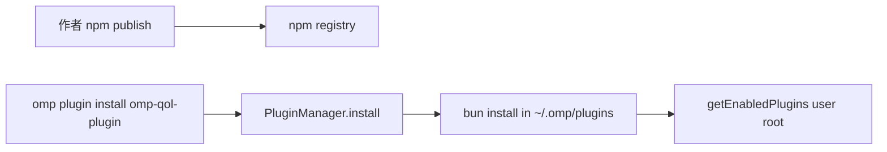
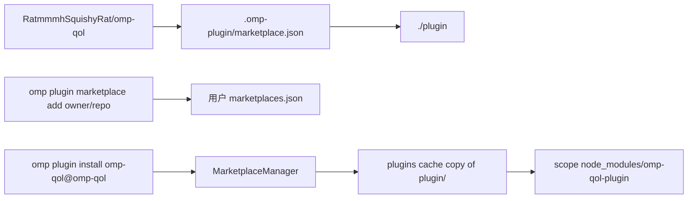
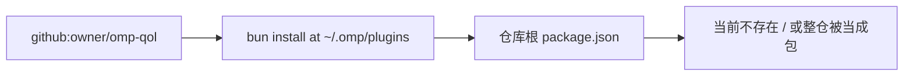

# Tech Clarification Report: omp-qol 用户可安装分发通道

**date**: 2026-08-15
**requirement input**: 仓库外用户能按官方 omp plugin 流程安装并使用；通道未定
**accessed**: 2026-08-15

## 1. Requirement Summary

- Source artifact: 支柱 `docs/ssot/pillars/distribution-delivery/user-installable-plugin.md`；调研 `docs/researches/omp-plugin-packaging-and-distribution.md`
- Problem statement: 今天只有 `.sandbox/install-plugin.ts` 这一条项目内拷贝路径。陌生人无法按宿主官方命令安装。
- Success criteria: README 第一条是真实可执行的官方安装命令；CI 在 push/PR 跑 `bun test` 与插件-only typecheck；发布路径与所选通道一致；若缺密钥则提交能提交的全部产物并列出剩余人工步骤，不伪造上架。
- Constraints and assumptions:
  - 插件源码在 `plugin/`，仓库根没有 `package.json`
  - 不改生产 `WATCHDOG.yml`；不给 `test-workspace` 擅自 `git init`；L6 不进默认 CI
  - 仓库 `RatmmmhSquishyRat/omp-qol` 已是 public（`gh repo view`，2026-08-15）
  - 宿主 17.3.4 不提供中央投稿市场；市场 npm source 装不上
  - 本机没有、也不应编造 npm token

## 2. Unknowns and Clarifications Needed

| Category | Missing detail | Why it matters | Action |
| --- | --- | --- | --- |
| Product | 作者是否还坚持「终端用户也绝不写 ~/.omp」 | 若坚持，官方 user-scope 安装全部不可用 | 按支柱「其他用户正常使用」处理：user scope 写的是**该用户**的配置根。开发约束仍只约束本仓库验收。不阻塞。 |
| Operations | 是否已有 npm 账号 / trusted publisher | npm 通道需要它 | 本轮不依赖。列为剩余人工步骤。 |
| Operations | 是否要把插件提交进第三方社区市场（如 DarkPhilosophy） | 那是别人的仓 | 不代为投稿。本仓自带 catalog 即可被 add。 |
| Compliance | LICENSE 文件缺失但 package.json 写 MIT | 分发面不完整 | 补 MIT LICENSE。 |
| Data | catalog 插件名用 `omp-qol` 还是 `omp-qol-plugin` | 市场 ID vs 包名 | 市场名/插件名用 `omp-qol`（ID `omp-qol@omp-qol`）；运行时包名保持 `omp-qol-plugin`。 |

Blocking unknowns: 无。可以选路。

## 3. Option Map

| Route | Positioning | Time-to-value | Main risks |
| --- | --- | --- | --- |
| A npm-only | 最快「一条 `omp plugin install <name>`」，但要 token 且改不了当前子目录布局的 git 安装 | 被 npm 账号挡住 | 未 publish 则陌生人命令失败；市场 npm source 仍不可用 |
| B 仓内 marketplace catalog（相对 `./plugin`） | 平衡基线：官方通道、支持 `--scope`、无密钥、适配子目录 | 提交 catalog + README 即可被 add | 用户要两条命令（add 再 install）；catalog version 必须与 package 对齐 |
| C git URL / GitHub Release tarball | 看起来更短，但根清单不存在；Release tarball 不是 `omp plugin install` 的一等 source | 若强行改根 package.json 会把整仓当插件拷走 | 装错树；WATCHDOG / docs 泄漏进用户缓存 |

另列一条对照：A+B 以后可叠加 npm，但不作为本轮主通道。

## 4. Community Signals Snapshot

| Component | Discussion intensity rank | Most discussed topics | Community best practices | Evidence |
| --- | --- | --- | --- | --- |
| 仓内 / 独立 marketplace.json | 1 | add 源、scope、upgrade、Claude 兼容路径 | 仓库自带 catalog；README 先写 marketplace add + install name@marketplace | [authoring-marketplaces.md](https://github.com/can1357/oh-my-pi/blob/main/docs/skills/authoring-marketplaces.md) 2026-08-15；[omp-headroom README](https://github.com/DarkPhilosophy/omp-headroom) 2026-08-15 |
| `omp plugin install github:user/repo` | 2 | 曾经被当成非法包名；#1527 才放行 | 适用于**根上就是插件包**的仓 | [PR #1527](https://github.com/can1357/oh-my-pi/pull/1527) 2026-08-15；[omp-insights package.json](https://github.com/oldschoola/omp-insights) 根清单 |
| npm `@oh-my-pi/*` / 第三方 npm | 3 | 宿主自己发 omp；插件侧作第二条通道 | 有 token 再 publish；CI 不自动发 | 宿主 `ci.yml` release_npm；omp-headroom 同时有 npm 页和 marketplace 安装段 |
| GitHub Release tarball 当安装源 | 4 | 几乎无插件安装讨论 | 宿主用 Release 发 omp 二进制，不是插件通道 | 宿主 `ci.yml` release_github；`classify-install-target.ts` 无 tarball 类型 |

## 5. Dependency Lifecycle Health Snapshot

| Dependency | Route usage | Latest release date | Last meaningful repo activity | Lifecycle status | Evidence | Decision note |
| --- | --- | --- | --- | --- | --- | --- |
| oh-my-pi / omp CLI | 全部 | v17.3.4（本机 `omp --version`；GitHub Releases 列表含该 tag） | 2026 持续发版 | active-maintained | https://github.com/can1357/oh-my-pi/releases 2026-08-15 | 安装通道以 17.3.4 代码为准 |
| Bun（宿主 `bun install` / 扩展加载） | A, C | 宿主文档要求与发行绑定 | 随 omp 发行 | active-maintained | `plugin-manager-installer-plumbing.md` 2026-08-15 | 插件保持 TS 入口，不自建编译步 |
| npm registry | A | n/a | n/a | active-maintained | registry.npmjs.org | 本轮不作为主路径；无 token |
| GitHub marketplace clone | B | n/a | n/a | active-maintained | `marketplace.md` git/local sources | 本仓已 public |
| GitHub Release 资产 | C | n/a | n/a | active-maintained | 宿主自己用，插件安装器不读 | 可作可选发布说明，不能当 install spec |

## 6. Route Cards

### Route A: npm-only

- Core architecture: 把 `plugin/` 当作 npm 包发布；用户 `omp plugin install omp-qol-plugin`
- Stack and versions: npm + `PluginManager.install` + bun install 到 `~/.omp/plugins`
- Integration pattern: 无 `--scope project`；只要用户根
- Code organization: 保持 `plugin/package.json`；CI tag 任务 `npm publish`
- Dependency health highlights: npm 本身健康；缺的是本仓凭证
- Community practice highlights: 宿主例子 `@oh-my-pi/exa`；omp-headroom 把 npm 当辅通道

| Dimension | Choice | Tradeoff | Evidence |
| --- | --- | --- | --- |
| Runtime model | 用户根 bun install | 不能项目 scope | `plugin-cli.ts:429-435` 2026-08-15 |
| Data strategy | 包 registry 为真源 | 未 publish 则命令对陌生人失败 | `manager.ts:476` |
| Deployment model | tag + npm token / OIDC | 本仓没有 token | 宿主 `ci.yml` release_npm |
| Dependency sustainability | npm + bun | 市场 npm source 仍不可用 | `source-resolver.ts:125-126` |
| Community best practice fit | 有官方例子，但 2026 第三方更常先走市场 | 与 headroom「marketplace recommended」不一致 | omp-headroom README 2026-08-15 |

### Route B: 仓内 marketplace catalog（相对 `./plugin`）

- Core architecture: 仓库根 `.omp-plugin/marketplace.json`，插件 source `./plugin`；用户 add 本仓再 install
- Stack and versions: MarketplaceManager + catalog semver + 宿主 cache 拷贝 `plugin/`
- Integration pattern: `--scope user|project` 都可用；upgrade 认 catalog version
- Code organization: 不移动 `plugin/`；不把根变成 npm 包
- Dependency health highlights: 只依赖宿主已有市场实现和 GitHub clone
- Community practice highlights: 官方 authoring-marketplaces、mini-marketplace、omp-headroom 自市场

| Dimension | Choice | Tradeoff | Evidence |
| --- | --- | --- | --- |
| Runtime model | 市场安装 + 与 npm/link 相同的 lockfile/junction | 用户多一步 add | `marketplace.md`；`manager.ts:820-830` |
| Data strategy | catalog version 与 package.json 对齐 | 漏改 catalog 则 upgrade 看不见 | `marketplace/manager.ts:409-417`；`marketplace.md` upgrade 段 |
| Deployment model | git push 即目录更新；tag 做 GitHub Release | 不是 npm | authoring-marketplaces publishing workflow |
| Dependency sustainability | 无新运行时依赖 | 依赖仓库保持 public | `gh repo view` 2026-08-15 visibility PUBLIC |
| Community best practice fit | 与 2026 第三方插件 README 主路径一致 | 两条命令，不是一条 | omp-headroom；DarkPhilosophy/omp-marketplace |

### Route C: git URL 或 GitHub Release tarball

- Core architecture: `omp plugin install github:RatmmmhSquishyRat/omp-qol`，或让用户下 Release 再 local install
- Stack and versions: `PluginManager.install` + bun git；或 `link()` 本地解压目录
- Integration pattern: 仅用户根；tarball 还要用户自己解压
- Code organization: 若要 git URL 成功，必须在仓库根放插件 `package.json`，或改成单包仓
- Dependency health highlights: git 安装通道健康（#1527 已合），但对本布局不匹配
- Community practice highlights: omp-insights 根上就是插件包，所以 git URL 成立

| Dimension | Choice | Tradeoff | Evidence |
| --- | --- | --- | --- |
| Runtime model | bun install git | 读根清单，不读 `plugin/` | `manager.ts:416-476`；本仓 glob 只有 `plugin/package.json` |
| Data strategy | 整仓或 tarball | 可能把 WATCHDOG.yml / docs 拷进缓存 | `cachePlugin` 对市场是整目录；git install 是 bun 包语义 |
| Deployment model | tag + Release 资产 | `classifyInstallTarget` 无 release-asset 类型 | `classify-install-target.ts:50-76` |
| Dependency sustainability | git 通道已维护 | 布局不匹配比通道更致命 | PR #1527 |
| Community best practice fit | 只适合根即插件的仓 | 本仓是研究+插件+验收工作区 | omp-insights vs 本仓 layout |

## 7. Root Divergence Points

| Divergence axis | Route A | Route B | Route C | Impact |
| --- | --- | --- | --- | --- |
| Boundary strategy | 发布面 = npm 包 = `plugin/` | 发布面 = catalog 指向 `plugin/` | 发布面 = 整仓或手解压 | B 不强迫改仓形 |
| Consistency model | npm version 为真 | catalog version + package version 双写 | git ref / tag | B 要对齐检查 |
| Contract ownership | npm name | 市场 ID `name@marketplace` + 包名 | git spec 不编码包名 | README 必须写清两条名字 |
| Failure handling | 未 publish 则安装失败 | add 失败（私有仓/无 catalog）或 install 失败 | bun install 找不到根清单 | 本仓 public + 补 catalog 即可验证 B |
| Dependency lifecycle risk | 卡在人类凭证 | 卡在宿主市场实现（已存在） | 卡在布局 | B 风险最低 |
| Community practice alignment | 辅通道 | 主通道 | 仅根插件仓 | 选 B |

## 8. Decision Matrix

权重按本任务约束：陌生人能装 > 不依赖密钥 > 适配当前目录 > 与宿主默认做法一致 > 以后能加 npm。

| Criterion | Weight | Route A | Route B | Route C | Notes |
| --- | --- | --- | --- | --- | --- |
| Delivery speed（无密钥也能闭环） | 20 | 2 | 9 | 3 | A 卡 token；C 卡根清单 |
| Maintainability | 15 | 7 | 8 | 3 | C 若改根包会污染整仓 |
| Performance headroom | 5 | 8 | 8 | 6 | 安装都是拷/装一次，差异小 |
| Security/compliance | 15 | 6 | 8 | 2 | C 易把生产 WATCHDOG / 工作区拷走 |
| Team fit（当前 monorepo 形仓） | 15 | 6 | 9 | 2 | `plugin/` 子目录是硬约束 |
| Dependency sustainability | 10 | 7 | 9 | 7 | B 无新依赖 |
| Community practice alignment | 20 | 6 | 9 | 4 | 2026 第三方主路径是 marketplace |
| Weighted total | 100 | 5.45 | 8.65 | 3.35 | B 明显领先 |

（加权：Σ weight/100 * score）

## 9. Recommendation

- Recommended route: **B — 仓内 marketplace catalog，source `./plugin`**
- Why this route wins in this context: 它是宿主文档写明、CLI 真正支持 `--scope`、社区第三方正在用、且不要求 npm token 的通道；同时只发布 `plugin/`，避开把整仓当包。
- Explicit tradeoffs accepted: 用户先 add 再 install（两条命令）；catalog version 与 package.json 必须一起改；不把 npm 当成已经发布。
- Fallback route and trigger conditions: 若日后有 npm trusted publisher，把 Route A 叠成第二条 README 命令，**不撤**市场路径。若宿主以后支持 `github:user/repo#path:plugin` 且经验证，可把 git URL 写成快捷方式，仍保留 catalog（upgrade / project scope 需要它）。

## 10. Implementation Blueprint

- Repository strategy (mono/multi): 保持单 git 根；插件继续在 `plugin/`
- Module boundaries and ownership:
  - 用户安装面：`.omp-plugin/marketplace.json` + README
  - 包元数据：`plugin/package.json`
  - 开发验收面：`.sandbox/install-plugin.ts` 保留，标明 dev-only
  - CI：`.github/workflows/ci.yml`（push/PR）、`release.yml`（tag，只做 GitHub Release + 元数据校验）
- Contract and schema governance: catalog `plugins[0].version` === `plugin/package.json` version；CI 检查
- CI/CD and test policy: `bun test` 118+；`tsc -p tsconfig.plugin.json` 只看 `plugin/src`；L6 除外；不自动 npm publish
- Migration and rollback strategy: 旧 sandbox 路径不删。用户卸载用 `omp plugin uninstall omp-qol@omp-qol`。回滚 = 复旧 catalog / 旧 tag。

## 11. Risk Register and Validation Plan

| Risk | Probability | Impact | Mitigation | Validation experiment |
| --- | --- | --- | --- | --- |
| 本地 marketplace add 会把 `plugin/node_modules` 一并 cp 进缓存 | M | M | git 树不含 node_modules；验证用隔离 `PI_CONFIG_DIR` | 隔离根下 add 本仓路径再 install，检查缓存无开发 junction |
| catalog 漏改 version，upgrade 不更新 | M | M | CI 对账脚本 | 改一处 version 应让 CI 红 |
| Windows `plugin link` EPERM | L | L | 用户主路径走市场拷贝+junction，不走 link | 隔离根 `omp plugin install omp-qol@omp-qol` |
| 陌生人 add 时主分支还没有 catalog | L | H | 本轮 push 必须含 catalog | push 后可用 GitHub shorthand 复验（可选） |
| CI checkout 宿主源码过重或 API 漂移 | M | M | pin `can1357/oh-my-pi` 到 v17.3.4；typecheck 不走进宿主 .md | 工作流在 ubuntu 跑 bun test |

## 12. Sources

| Claim | Source type | URL / path | Accessed at | Confidence |
| --- | --- | --- | --- | --- |
| install 四类 source | 宿主代码 + 本机 CLI | `plugin-cli.ts:965-970`；`omp plugin --help` 17.3.4 | 2026-08-15 | H |
| --scope 仅市场 | 宿主代码 | `plugin-cli.ts:390-435` | 2026-08-15 | H |
| 市场 npm source 拒装 | 宿主代码 + 官方文档 | `source-resolver.ts:125-126`；marketplace.md | 2026-08-15 | H |
| 无中央投稿市场 | 官方文档 | authoring-marketplaces.md publishing workflow | 2026-08-15 | H |
| 第三方默认走自带 catalog | 社区仓 | DarkPhilosophy/omp-headroom；DarkPhilosophy/omp-marketplace | 2026-08-15 | H |
| git install 需要根 package.json | 宿主代码 + 本仓布局 | `manager.ts:476`；仓内仅 `plugin/package.json` | 2026-08-15 | H |
| 本仓 public | GitHub API | `gh repo view RatmmmhSquishyRat/omp-qol` | 2026-08-15 | H |
| 密封二进制加载 TS | 宿主代码 | `extensions/loader.ts`；`legacy-pi-compat.ts` | 2026-08-15 | H |

## 13. Handoff for impl-route-guide-author

- Selected route: B（仓内 marketplace catalog，`source: "./plugin"`）
- Rejected: A 作为主路径（无 token，且失去 project scope）；C 作为主路径（布局不匹配，有整仓拷贝风险）
- Locked stack: omp 17.3.4 行为；catalog 路径 `.omp-plugin/marketplace.json`；市场名 `omp-qol`；插件目录名 `omp-qol`；包名 `omp-qol-plugin`；版本与现有 `0.3.0` 对齐直到下次有意 bump
- Assumptions: 终端用户允许写自己的 `~/.omp`；本仓库验收仍用 sandbox、不写作者全局根
- Unresolved risks: CI 首次在 GitHub 跑宿主源码链接是否一次过；需实现后用隔离 `PI_CONFIG_DIR` 验证官方 install
