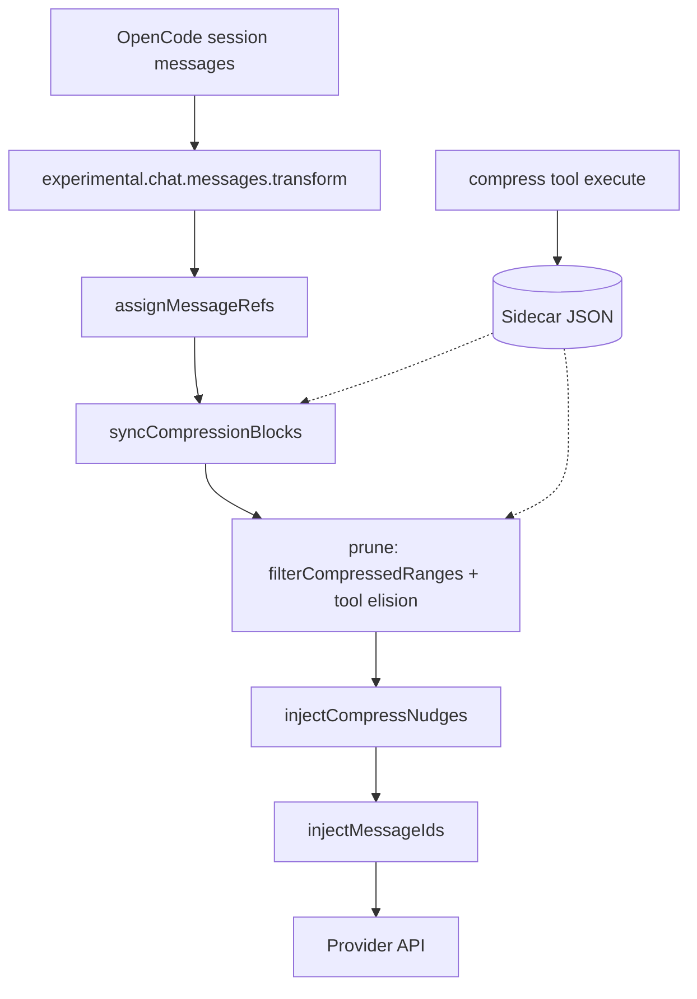

# D1: OpenCode Dynamic Context Pruning — Source Mechanisms vs ICM Pillar

**Track:** D1 (`research/00-index.md`)  
**Date:** 2026-08-16  
**Source repo:** `docs/ref_repos/opencode-dynamic-context-pruning`  
**Source commit:** `85b6f5ceba144fee9e65eb28dc36cab1b960e418` (merge PR #580, 2026-08-16 clone)  
**Prior transcripts (read-only):** `docs/researches/dcp/omp_dcp_research_transcript.md`, `dcp_tool_call_result_compression_supplement_transcript.md`, `OMP_DCP_message_id_supplement_transcript.md`  
**Pillar under test:** agent decides any messages / any content / any time; plugin maximizes freedom; plugin-decided automatic compression policy is **not** the product (`INVARIANTS.md` §2, tension table row 1).

**Evidence grades:** E0 README/marketing · E1 naming/inference · E2 single-file · E3 pipeline-traced · E4 multi-path + prior transcript corroboration

---

## Executive summary

OpenCode DCP is a **wire-time overlay**: it hooks `experimental.chat.messages.transform` and mutates the **outbound** message array before each LLM call. OpenCode session storage is **not** rewritten; compression metadata lives in a **plugin sidecar** (`~/.local/share/opencode/storage/plugin/dcp/{sessionId}.json`). Agent-initiated `compress` records block graphs; `prune()` projects summaries and elides marked tool I/O on the wire.

For ICM, the **reuse candidates** are overlay projection, block IDs, nested compression, decompress-as-toggle, and tool-result replacement that preserves call pairing. The **reject candidates** are default-on auto dedup/error-purge, mandatory nudges, plugin-side “BLOCKED” user messages, the inverted manual-mode model, and the `m0001` alias cap — all conflict with the freedom pillar unless re-framed as **opt-in** agent aids.

---

## 1. Overlay vs mutation

### Finding

DCP **does not mutate OpenCode session history**. It mutates the **`output.messages` array** passed into the transform hook each request. Compression decisions persist in plugin state, not in host messages.

**Grade: E3**

### Mechanism

Entry point registers the transform hook:

```63:70:docs/ref_repos/opencode-dynamic-context-pruning/index.ts
        "experimental.chat.messages.transform": createChatMessageTransformHandler(
            ctx.client,
            state,
            logger,
            config,
            prompts,
            hostPermissions,
        ) as any,
```

Per-request pipeline (`lib/hooks.ts`):

1. `filterMessagesInPlace` — drop malformed shapes  
2. `assignMessageRefs` — alias layer  
3. `syncCompressionBlocks` — reconcile block activity vs visible messages  
4. `syncToolCache` / `buildToolIdList` — tool metadata for strategies  
5. **`prune`** — apply compression projection + tool I/O elision  
6. `injectCompressNudges` / `injectMessageIds` — wire-only injections  
7. `stripStaleMetadata` — cleanup  

The handler **mutates `output.messages` in place** (splice, replace part fields, push synthetic messages). No call writes back to OpenCode’s message store.

When the agent calls `compress`, the tool handler updates **in-memory + sidecar** state via `applyCompressionState` → `saveSessionState`. The original messages remain in OpenCode; only the next transform’s projection changes.

Sidecar persistence explicitly documents intent:

```1:5:docs/ref_repos/opencode-dynamic-context-pruning/lib/state/persistence.ts
/**
 * State persistence module for DCP plugin.
 * Persists pruned tool IDs across sessions so they survive OpenCode restarts.
 * Storage location: ~/.local/share/opencode/storage/plugin/dcp/{sessionId}.json
 */
```

Persisted fields: `prune.tools`, `prune.messages` (blocks, anchors, message prune map), nudge anchors, stats — **not** rewritten host messages.

### OpenCode native compaction interaction

`checkSession` detects host compaction (`assistant` message with `summary === true`) and calls `resetOnCompaction`, wiping plugin tool-prune map, compression blocks, and **message alias maps** (`lib/state/utils.ts` `resetOnCompaction`). Wire projection then realigns to the new host-truncated history.

### ICM mapping

Matches ICM invariant §6: overlay is append-only side state + transform, not in-place journal mutation. OMP equivalent: `pi.on("context")` deep copy, return modified messages.

---

## 2. Address layer

### Finding

DCP exposes **two parallel ID spaces** to the model:

| ID | Meaning | Canonical backing | Persisted? |
|---|---|---|---|
| `m0001`…`m9999` | Raw message alias | `message.info.id` (OpenCode) | **No** — rebuilt each transform; cleared on host compaction |
| `b1`, `b2`, … | Compression block | Plugin `CompressionBlock.blockId` | **Yes** — sidecar `blocksById`, monotonic `nextBlockId` |

Boundary IDs in **range mode** may be **either** `mNNNN` or `bN`. **Message mode** accepts only `mNNNN` for `messageId`.

**Grade: E3**

### Message aliases (`m0001`)

```119:172:docs/ref_repos/opencode-dynamic-context-pruning/lib/message-ids.ts
export function assignMessageRefs(state: SessionState, messages: WithParts[]): number {
    // ...
        const rawMessageId = message.info.id
        // ...
        const ref = allocateNextMessageRef(state)
        state.messageIds.byRawId.set(rawMessageId, ref)
        state.messageIds.byRef.set(ref, rawMessageId)
```

- Format: `m` + 4-digit zero-padded index (`formatMessageRef`).  
- Hard cap: `MESSAGE_REF_MAX_INDEX = 9999`; overflow throws (`Message ID alias capacity exceeded`).  
- **Not serialized** in `saveSessionState` — only `prune` + `nudges` + `stats` persist.  
- Injected into wire context as XML: `<dcp-message-id priority="high">m0007</dcp-message-id>` (`injectMessageIds`, `formatMessageIdTag`).  
- Appended to **every tool output part** of a message (and text parts for user messages) so boundaries survive tool-result-only views.

Protected user messages (message mode + `protectUserMessages`) inject `<dcp-message-id>BLOCKED</dcp-message-id>` instead of an alias.

### Block IDs (`bN`)

```52:60:docs/ref_repos/opencode-dynamic-context-pruning/lib/compress/state.ts
export function wrapCompressedSummary(blockId: number, summary: string): string {
    const header = COMPRESSED_BLOCK_HEADER
    const footer = formatMessageIdTag(formatBlockRef(blockId))
    // ...
}
```

- Allocated via monotonic `nextBlockId` (`allocateBlockId`).  
- Stored in sidecar with full block metadata: anchor, consumed/nested blocks, compress call provenance (`compressMessageId`, `compressCallId`), summary text, active flag.  
- Range boundaries may reference `bN`; `parseBoundaryId` resolves both kinds (`lib/message-ids.ts`).

### Range vs message mode (addressing semantics)

| Aspect | Range (`config.compress.mode === "range"`, default) | Message (experimental) |
|---|---|---|
| Tool args | `startId`, `endId` per entry (m or b) | `messageId` (m only) per entry |
| Selection unit | Contiguous span of messages/tools between boundaries | One message per entry |
| Priority tags | Not computed | `buildPriorityMap` → `low`/`medium`/`high` on injected tags |
| Compress-tool self cleanup | Implicit (future range may cover compress assistant msg) | **Explicit** — `messageHasCompress` → forced `high` priority |

### Compaction / orphan risk

`syncCompressionBlocks` deactivates blocks whose `compressMessageId` is absent from the current message list (e.g. after host compaction removed the originating compress call):

```39:50:docs/ref_repos/opencode-dynamic-context-pruning/lib/messages/sync.ts
        const hasOriginMessage =
            typeof block.compressMessageId === "string" &&
            block.compressMessageId.length > 0 &&
            messageIds.has(block.compressMessageId)

        if (!hasOriginMessage) {
            block.active = false
            // ...
            missingOriginBlockIds.push(block.blockId)
```

Boundary IDs recorded as `mNNNN` strings in block metadata can **orphan** when alias maps reset but block records survive — known pain point (prior transcript E2/E3).

### ICM mapping

Prefer **`SessionEntry.id`-based addresses** (stable, no 9999 cap) over copying `m0001`. Block IDs (`bN`) and nested block graphs are worth stealing. Do not depend on non-persisted alias maps for long-lived compression records.

---

## 3. `compress` tool schema and agent UX

### Finding

One registered tool name `compress`; implementation swaps by mode at plugin init. Descriptions combine **editable runtime prompts** + **non-overridable format extension**.

**Grade: E3**

### Schema

**Range** (`lib/compress/range.ts`):

```29:53:docs/ref_repos/opencode-dynamic-context-pruning/lib/compress/range.ts
        topic: tool.schema.string().describe("Short label (3-5 words)..."),
        content: tool.schema.array(
            tool.schema.object({
                startId: tool.schema.string().describe("Message or block ID... m0001, b2"),
                endId: tool.schema.string().describe("..."),
                summary: tool.schema.string().describe("Complete technical summary replacing all content in range"),
            }),
        )
```

**Message** (`lib/compress/message.ts`):

```16:38:docs/ref_repos/opencode-dynamic-context-pruning/lib/compress/message.ts
        content: tool.schema.array(
            tool.schema.object({
                messageId: tool.schema.string().describe("Raw message ID to compress (e.g. m0001)"),
                topic: tool.schema.string().describe("Short label..."),
                summary: tool.schema.string().describe("Complete technical summary replacing that one message"),
            }),
        )
```

Format JSON schemas are **appended** from `lib/prompts/extensions/tool.ts` and documented as unsafe to override via custom prompts.

### What the model is told

1. **System prompt injection** (`experimental.chat.system.transform`, `lib/prompts/system.ts`): philosophy — compress closed sections, don’t compress active work, `<dcp-message-id>` tags are environment metadata.  
2. **Tool description** (`lib/prompts/compress-range.ts` or `compress-message.ts`): exhaustive summary rules, user-intent fidelity, batching, boundary rules, `(bN)` placeholders (range), priority cleanup (message).  
3. **Wire injections**: message IDs, `<dcp-system-reminder>` nudges (see §4).  
4. **Permission gate**: `toolCtx.ask({ permission: "compress" })` in `prepareSession`; host may force `deny` (`index.ts` config hook).  
5. **Manual mode**: compress blocked until `/dcp-compress` injects `<compress triggered manually>` user text (`lib/commands/manual.ts`, `lib/compress/pipeline.ts`).  
6. **Notifications**: optional chat/toast showing summary (`config.compress.showCompression`).

### Execution flow

`prepareSession` → fetch raw messages → `deduplicate` + `purgeErrors` → `buildSearchContext` → resolve boundaries → `applyCompressionState` → `saveSessionState` → short tool return string (`Compressed N messages into [Compressed conversation section].`).

Summaries stored wrapped with header + block footer tag; range mode may expand `(bN)` placeholders into nested block content before storage.

### ICM mapping

**Steal:** batch compress API, separate format/schema from instructional prompt, short tool return + rich stored summary, permission tier.  
**Reject:** system prompt that prescribes *when* to compress (pillar: timing is agent’s problem; plugin supplies capability + optional hints).

---

## 4. Auto policies: dedup, error purge, nudges

### Finding

Three automatic behaviors exist. **None** are agent-initiated compressions; they either **mark tool calls for wire elision** or **inject reminders**. Defaults are **on** (`lib/config.ts` `defaultConfig`).

**Grade: E3**

### 4.1 Deduplication (same tool + same args)

`lib/strategies/deduplication.ts`:

- Groups tool calls by `tool::JSON(normalizedParams)`.  
- For duplicates, marks **all but the most recent** `callID` in `state.prune.tools`.  
- Skips protected tool names and protected file paths.  
- **`compress` is in default protected tool lists** — never dedup-elided.  
- Respects `manualMode && !config.manualMode.automaticStrategies` → skip.

**Critical:** `deduplicate()` is invoked only from `prepareSession` (`lib/compress/pipeline.ts` lines 72–73) — i.e. **when the agent calls `compress`**, not on every LLM request. Once marked, **`prune()` on every transform** replaces those tools’ outputs (and error inputs) on the wire.

### 4.2 Error-arg purge

`lib/strategies/purge-errors.ts`:

- Selects tools with `metadata.status === "error"` older than `strategies.purgeErrors.turns` (default 4).  
- Marks `callID` in `state.prune.tools`.  
- `pruneToolErrors` replaces **string fields** in `part.state.input` with `[input removed due to failed tool call]`; **error output preserved**.  
- Same invocation gate as dedup (`prepareSession` only).  
- Default **enabled**.

### 4.3 Wire elision (`prune()`)

`lib/messages/prune.ts` applies `state.prune.tools`:

| Target | Replacement | Exclusions |
|---|---|---|
| Completed tool **output** | `[Output removed to save context...]` | `question`, `edit`, `write` |
| Errored tool **string inputs** | `[input removed due to failed tool call]` | — |
| Completed `question` tool inputs | `[questions removed - see output...]` | — |

`pruneFullTool` (remove entire tool parts) exists but is **commented out** — pairing preserved.

Turn protection (`turnProtection.enabled`, default off): recent tools skip **cache population** in `syncToolCache`, so strategies cannot mark them until aged.

### 4.4 Nudges

`injectCompressNudges` (`lib/messages/inject/inject.ts`) runs **every transform** unless:

- `compress.permission === "deny"`, or  
- `state.manualMode` is truthy, or  
- Last assistant message contains a completed `compress` call (clears anchors).

Three nudge classes:

| Nudge | Trigger | Prompt file | Force |
|---|---|---|---|
| Context limit | Tokens > `maxContextLimit` (+ summary buffer) | `context-limit-nudge.ts` | **“You MUST use the compress tool now”** |
| Turn | Tokens ≥ `minContextLimit` and last msg is user | `turn-nudge.ts` | soft/strong via `nudgeForce` |
| Iteration | ≥ `iterationNudgeThreshold` messages since last user | `iteration-nudge.ts` | soft |

Anchors stored in sidecar; nudges injected into user or assistant text as `<dcp-system-reminder>...</dcp-system-reminder>`.

Message mode adds **priority-target lists** to nudges (high-priority refs before anchor).

Defaults: `nudgeFrequency: 5`, `minContextLimit: 50000`, `maxContextLimit: 100000`, strategies dedup+purgeErrors **enabled**.

### Can the agent disable?

| Mechanism | Effect |
|---|---|
| `strategies.deduplication.enabled: false` | No new dedup marks at compress time |
| `strategies.purgeErrors.enabled: false` | No new error marks |
| `manualMode.enabled: true` | Blocks nudges; blocks compress unless `/dcp-compress`; optional `automaticStrategies: false` blocks dedup/purge at compress |
| `compress.permission: deny` | No tool, no nudges, no ID injection |
| Host permission override | May force deny (`index.ts`) |

There is **no per-turn agent opt-out** for already-marked tool prunes except decompressing the session or host compaction reset.

### ICM contrast (pillar)

| DCP behavior | Pillar tension |
|---|---|
| Default-on dedup/purge | Plugin decides **what** to elide without agent compress intent |
| Context-limit “MUST compress” | Plugin decides **when** |
| BLOCKED user messages | Plugin denies agent address space |
| Manual mode = freedom | Inverted — freedom should be default, automation opt-in |

---

## 5. Self-footprint: compress tool arguments

### Finding

**No immediate scrub.** The `compress` call’s large `summary` argument is stored in OpenCode history as normal tool **input** and is sent to the model on subsequent turns until the containing assistant message is itself compressed or elided.

**Grade: E4** (pipeline + priority + prompt + transcript corroboration)

### Evidence chain

1. `compress` records `compressMessageId` / `compressCallId` on blocks but does **not** add the compress assistant message to `byMessageId` prune map.  
2. `filterCompressedRanges` skips messages in compressed ranges — **not** the compress call message (unless that message falls inside a later range).  
3. `pruneToolOutputs` skips tools in `state.prune.tools`; **`compress` is protected** from dedup marking (`DEFAULT_PROTECTED_TOOLS` includes `"compress"`).  
4. **Message mode only:** `messageHasCompress` → `high` priority (`lib/messages/priority.ts` lines 54–57).  
5. **Message mode prompt** (`lib/prompts/compress-message.ts` lines 21–22): prior compress-tool results should be minimally summarized in a **broader** pass, not via a dedicated re-compress call.  
6. **Range mode:** no special priority; cleanup waits until a range includes the compress assistant message.

### Temporary duplicate on wire

Immediately after compress, the model may see:

- Injected synthetic summary (from block), **and**  
- Full prior `compress` tool call with large `input.summary`.

This is **by design** (delayed self-recycling), not a bug.

### ICM mapping

ICM should plan **agent-visible** self-footprint (InitiativeSummary args may be huge). Options aligned with pillar: agent-driven second pass, wire-time elision of **only outbound** compress args after block recorded, or explicit expand/compress cycle — **not** silent plugin scrub without agent action unless opt-in.

---

## 6. Expand / decompress

### Finding

Decompress is **overlay toggle**, not journal restore. Original messages were never deleted.

**Grade: E3**

### Mechanism

`/dcp decompress <n>` (`lib/commands/decompress.ts`):

1. Parses block id (`b2` or `2`).  
2. Sets matching blocks `active = false`, `deactivatedByUser = true`.  
3. `syncCompressionBlocks` reactivates **nested** inner blocks whose parent was deactivated.  
4. Persists sidecar; sends informational ignored user message with restore stats.

Effects on wire:

- `filterCompressedRanges` stops skipping messages in deactivated blocks.  
- Stops injecting synthetic summaries at anchors.  
- Tool prune marks **unaffected** (dedup/error elision persists).

Nested guard: cannot restore inner block while outer block active — must restore outer first.

**Recompress** and **sweep** commands also exist (`lib/commands/recompress.ts`, `sweep.ts`) for operator workflows; decompress is the primary “expand” path.

### ICM mapping

Matches pillar “expand any summary” **if** expand means **restore wire visibility** of canonical journal entries. OMP should implement expand as overlay tombstone removal / block deactivation on append-only overlay state, not journal rewrite.

---

## 7. Tool-call / result protocol safety

### Finding

DCP optimizes for **keeping assistant tool parts and callIDs** while rewriting content strings. Whole-message removal is reserved for agent-compressed ranges.

**Grade: E3**

### Safe patterns

1. **Compressed messages:** removed from wire array; replaced by **synthetic user message** with deterministic IDs (`createSyntheticUserMessage` — SHA256-seeded `msg_dcp_summary_*` / `prt_dcp_summary_*`). Role shift (assistant/tool history → user text blob) is intentional for provider APIs.  
2. **Tool output elision:** same tool part, same `callID`, output string replaced.  
3. **Tool input elision (errors/questions):** same part; input object fields replaced in place.  
4. **ID injection:** appended to tool **output** strings, not removing calls.  
5. **Hallucination strip:** removes model-generated `<dcp-*>` tags from text/tool outputs before send (`stripHallucinations`).  
6. **Shape filter:** drops messages failing `isMessageWithInfo` (requires user|assistant, id, sessionID, parts array).  
7. **Native compaction:** messages before `lastCompaction` timestamp treated as compacted — skip tool cache / prune passes (`isMessageCompacted`).

### Risky / commented paths

- `pruneFullTool` would remove tool parts and possibly empty whole assistant messages — **disabled** (comment at `lib/messages/prune.ts` line 21).  
- Removing arbitrary assistant messages without synthetic replacement would break call/result ordering — DCP avoids except via full range compression + summary inject.

### ICM mapping

Aligns with invariant §8 (provider-protocol safe projection). OMP must preserve `toolCallId` pairing on tool-result messages; block-level message removal requires synthetic replacement or provider-neutral text blocks (per prior OMP transcript E3).

---

## 8. What QOL must NOT copy (pillar violations)

These are **product decisions** in OpenCode DCP that conflict with ICM `INVARIANTS.md` §2 unless re-engineered as **explicit opt-in agent aids**:

| # | DCP mechanism | Source | Why it violates freedom pillar |
|---|---|---|---|
| 1 | Default-on **deduplication** eliding duplicate tool I/O | `defaultConfig.strategies.deduplication.enabled: true`, `deduplication.ts` | Plugin decides **which messages/tools** lose content without agent choosing targets |
| 2 | Default-on **error-arg purge** after N turns | `purgeErrors.enabled: true`, `purge-errors.ts` | Plugin decides **when** failed-call inputs disappear |
| 3 | **Mandatory** context-limit nudge | `context-limit-nudge.ts` “You MUST use compress now” | Plugin decides **when** compression is required |
| 4 | Turn / iteration nudges on by default | `inject.ts`, default limits | Persistent plugin pressure on **when** to compress |
| 5 | **`BLOCKED`** user message IDs | `injectMessageIds` + `protectUserMessages` | Plugin removes addressability agent should retain (pin/protect should be agent tool, not wire censorship) |
| 6 | **Manual mode inverted** — automation default, freedom requires `/dcp manual` | `manual.ts`, `defaultConfig.manualMode.enabled: false` | Pillar: agent freedom is default; automation is optional |
| 7 | System prompt prescribing compress **when/when-not** | `lib/prompts/system.ts` | Heuristic instructions OK; **plugin-owned policy** is not |
| 8 | **`m0001` alias cap (9999)** | `message-ids.ts` | Artificial limit on agent address space; prefer stable entry IDs |
| 9 | Sidecar-only state **decoupled from journal** | `persistence.ts` | ICM invariant §6 prefers append-only **session entries**, not orphan JSON files |
| 10 | Auto strategies gated on **compress invocation** | `pipeline.ts` | Couples silent elision to unrelated agent action; opaque to agent |

### What QOL **should** steal (mechanisms, not policies)

| Mechanism | Source | ICM use |
|---|---|---|
| Transform-on-wire overlay | `hooks.ts` | `context` hook engine |
| Block graph + nested `(bN)` / consumed blocks | `compress/state.ts`, `sync.ts` | InitiativeSummary blocks |
| Decompress = deactivate block, restore wire view | `decompress.ts` | Expand API |
| Synthetic summary injection | `prune.ts`, `utils.ts` | Provider-safe summary projection |
| Tool output replace, keep `callID` | `pruneToolOutputs` | Tool-result compression |
| Separate format schema from editable prompt | `prompts/extensions/tool.ts` | Tool contract stability |
| Delayed self-footprint awareness | `priority.ts`, `compress-message.ts` | Document + agent tools, not silent scrub |
| Permission tier + kill switch | `index.ts`, `compress-permission.ts` | Reuse QOL envelope/kill-switch pattern |
| Host compaction detection + state reset | `state/state.ts` | Reconcile overlay after OMP native compact |

---

## Appendix A: Transform pipeline (reference)



## Appendix B: Default config snapshot

From `lib/config.ts` `defaultConfig` (E3):

- `compress.mode: "range"`, `permission: "allow"`  
- `strategies.deduplication.enabled: true`  
- `strategies.purgeErrors.enabled: true`, `turns: 4`  
- `manualMode.enabled: false`, `automaticStrategies: true`  
- `compress.minContextLimit: 50000`, `maxContextLimit: 100000`  
- `nudgeFrequency: 5`, `iterationNudgeThreshold: 15`, `nudgeForce: "soft"`  

## Appendix C: Related workspace tracks

- **D2** `pi-dcp.md` — Pi extension port; toolCallId addressing, `context` event overlay proof.  
- **H2** `host-context-event.md` — OMP hook shape for same overlay pattern.  
- **H4** `host-addressing.md` — `SessionEntry.id` vs DCP `m0001`.  
- **U1** `agent-ux.md` — tool/prompt lessons from DCP transcripts.

---

## Open questions for ICM (not resolved by DCP source)

1. Should OMP dedup/error-elide exist at all, or only via explicit agent `InitiativeSummary` / pin tools?  
2. Where should block metadata live — custom `SessionEntry` types vs sidecar? (Pillar favors journal append-only.)  
3. Self-footprint: agent tool to “seal” compress call args on wire after block commit?  
4. Reconcile alias orphan after host compaction — DCP resets aliases but block `startId`/`endId` strings may stale.
