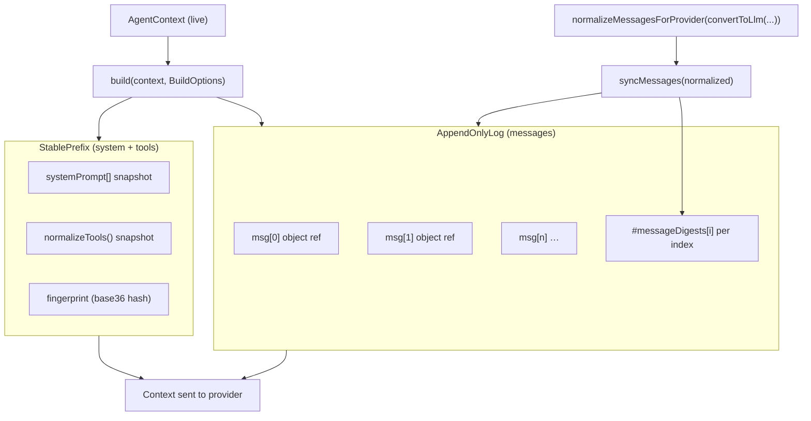

# H3: OMP 17.3.4 Prompt Cache / Append-Only Context Manager

**Host:** `docs/ref_repos/oh-my-pi-main` @ `de6b7974a0` (release **17.3.4**, 2026-08-14)  
**Primary sources:** `packages/agent/src/append-only-context.ts`, `packages/agent/src/agent-loop.ts`, `packages/agent/test/append-only-context.test.ts`, `packages/agent/src/compaction/pruning.ts`, `packages/agent/src/run-collector.ts`, `packages/agent/src/telemetry.ts`, `packages/catalog/src/types.ts` (`Usage`), `scripts/session-stats/audit.ts`, `packages/coding-agent/src/config/append-only-context-mode.ts`

---

## Executive verdict on the 2026-08-09 claim

**Claim (2026-08-09 foundation / Delta 9):**

> Cache cost is **earliest divergence position + changed suffix**, not binary rewrite = lost-all-cache. Tail pins and compression-tool self-footprint scrub are structurally favored over system-prefix churn or mid-history insertion.

**Verdict: CONFIRMED on 17.3.4**, with scope limits documented below.

Evidence:

1. **`AppendOnlyContextManager.syncMessages`** (fixed in **16.1.18**, issue **#3406**, still present unchanged in 17.3.4) no longer clears the entire append-only log on any in-place rewrite. It finds the **longest byte-stable message prefix**, truncates the log to that index, and re-appends only the diverged tail.
2. Host pruning/compaction code explicitly models cache cost as **suffix re-write** after a mutation point (`computeMessageSuffixTokens`, `cacheWarmSuffixTokens`, `DEFAULT_SUFFIX_TOKEN_LIMIT = 8_000`).
3. Integration tests assert **object identity** for preserved prefix messages across rewrites — the mechanism OMP uses to keep provider-side prefix caches warm.

**Not yet host-implemented (QOL design target only):** compression-tool **self-footprint scrub** in projection. OMP has no DCP-style scrub of a successful compress tool call's large `summary` argument; the 2026-08-09 claim treats that as structurally cache-friendly *once implemented*, not as existing host behavior.

**17.3.4 delta vs 17.2.12:** No further changes to `AppendOnlyContextManager` between 17.2.12 and 17.3.4. 17.3.4 agent changelog is unrelated (Codex V2 compaction header). The divergence-prefix model from Delta 9 remains accurate.

---

## Architecture overview

OMP separates prompt-cache stability into two layers inside `AppendOnlyContextManager`:



**Call site:** `prepareProviderCall` in `packages/agent/src/agent-loop.ts`:

1. Optional `transformContext` on agent messages
2. `convertToLlm` → `normalizeMessagesForProvider`
3. If `config.appendOnlyContext` is set: `syncMessages(normalized)` then `build(...)`
4. Else: fresh `{ systemPrompt, messages, tools }` each turn
5. Optional `transformProviderContext` **after** append-only assembly
6. Optional owned-dialect inband tool prompt injection **after** append-only assembly

**Enablement:** `provider.appendOnlyContext` setting (`auto` | `on` | `off`, default `auto`) via `shouldEnableAppendOnlyContext` in `packages/coding-agent/src/config/append-only-context-mode.ts`.

| `auto` enables for | Rationale |
|---|---|
| `deepseek` | Prefix-cache provider |
| `ollama`, `ollama-cloud`, `lm-studio`, `llama.cpp` | llama.cpp-style KV prefix reuse |
| Loopback / RFC1918 / `.local` base URLs | User-registered local inference servers |
| `compatConfig.supportsStore === true` | OpenAI Responses-style store/chaining |

Anthropic and many cloud providers often run **without** append-only mode unless forced `on`. Cache economics still apply at the provider layer; OMP just skips client-side byte stabilization when disabled.

---

## Exact fingerprint / digest algorithms

### 1. StablePrefix fingerprint (`computeFingerprint`)

**Purpose:** Detect when frozen **system prompt + normalized tool specs** must rebuild.

**Payload** (JSON.stringify, key order fixed in source):

```json
{
  "s": systemPrompt,           // string[] as-is
  "t": tools.map(t => ({
    "n": t.name,
    "d": t.description,
    "p": t.parameters,
    "s": t.strict,
    "cf": t.customFormat,
    "cw": t.customWireName
  })),
  "i": options.intentTracing,
  "pd": options.pruneToolDescriptions
}
```

**Hash:** 32-bit rolling hash (Java `String.hashCode` / djb2 variant):

```typescript
let hash = 0;
for (let i = 0; i < payload.length; i++) {
  hash = ((hash << 5) - hash + payload.charCodeAt(i)) | 0;
}
return (hash >>> 0).toString(36);  // unsigned, base-36 string
```

**Behavior:**

- First `build()` snapshots `systemPrompt` (shallow copy) and `normalizeTools(...)` output.
- Subsequent `build()` returns `changed: false` when fingerprint matches; **same object references** reused.
- `invalidate()` / fingerprint change → version increment, full prefix rebuild on next `build()`.
- Tool **order** matters. `["A","B"]` vs `["A\nB"]` system prompt arrays produce **different** fingerprints (array structure, not joined text).

### 2. Per-message digest (`#messageDigest`)

**Purpose:** Find first index where provider-bound message content diverges from last sync.

**Payload:**

```json
{
  "r": role,
  "c": content,
  "pp": providerPayload,
  "tc": toolCalls ?? tool_calls,
  "tcid": toolCallId ?? tool_call_id,
  "tn": toolName ?? name,
  "err": isError,
  "id": id
}
```

**Hash:** Same 32-bit algorithm; result stored as **unsigned integer** in `#messageDigests[]` (not base36).

**Important:** This is a **digest of selected normalized message fields**, not a hash of on-the-wire HTTP bytes. It is designed to mirror fields the provider serializer is sensitive to. Collisions are theoretically possible but treated as negligible; tests treat digest equality as stability.

**Fields intentionally excluded:** `timestamp`, `usage`, `model`, `provider`, streaming metadata, and other agent-layer fields that do not affect provider serialization. (Advisor runtime uses a **different**, richer fingerprint for UI dedupe — see `packages/coding-agent/src/advisor/runtime.ts`.)

### 3. Longest stable prefix (`#longestStablePrefix`)

```typescript
const bound = Math.min(this.#lastSyncCount, normalizedMessages.length);
for (let i = 0; i < bound; i++) {
  if (this.#messageDigest(normalizedMessages[i]) !== this.#messageDigests[i]) {
    return i;  // first divergence index
  }
}
return bound;
```

**Sync algorithm (`syncMessages`):**

| Case | Behavior |
|---|---|
| `normalizedMessages.length < #lastSyncCount` | **Compaction shrink:** `log.clear()`, reset digests (no prefix carry-forward) |
| In-place rewrite, same length | Truncate log to `stableCount`, trim digest array, re-append tail from index `stableCount` |
| Normal append | Append new messages from `#lastSyncCount` |
| Unchanged resync | No-op when all digests match |

**Object identity:** For stable indices, the log **keeps the original object references** (`entries[i] === original`). For diverged indices, new objects from the normalized array are appended. This matches provider cache semantics: unchanged leading messages must be **the same serialized content**; preserving references avoids accidental reserialization drift.

---

## What counts as a message change

A message is **stable** iff `#messageDigest(new) === #messageDigests[i]`.

**Triggers divergence (non-exhaustive, from tests + source):**

| Field | Example |
|---|---|
| `content` | `"original long result"` → `"[pruned]"` |
| `toolCallId` / `tool_call_id` | `"old-call"` → `"new-call"` |
| `toolName` / `name` | `"read"` → `"write"` |
| `isError` | `false` → `true` |
| `providerPayload` | OpenAI Responses native history item text change |
| `toolCalls` / `tool_calls` | In-place mutation of `function.arguments` |
| `id` | Assistant message id change |

**Does not trigger divergence (by design):**

- Agent-only metadata excluded from digest (timestamps, usage, etc.)
- Resync with identical normalized content at same length (no-op)

**Cascading invalidation:** Divergence at index `i` invalidates cache for messages **`i..end`** (suffix). Messages **`0..i-1`** remain stable. This matches prefix-cache provider behavior: one changed token at position *p* breaks prefix match from *p* onward.

---

## System / tool prefix stability

### StablePrefix scope

Frozen once per fingerprint match:

- `systemPrompt: string[]` (snapshot copy)
- `tools: Tool[]` after `normalizeTools(context.tools, { injectIntent, pruneDescriptions })`

**Invalidates when:**

- System prompt strings change (including array segmentation)
- Tool set, order, descriptions, parameters, strict/customFormat/customWireName change
- `intentTracing` or `pruneToolDescriptions` BuildOptions flip
- Explicit `invalidate()`, `reset()`, `invalidateForModelChange()`

**Does not auto-track:** Live `AgentContext.systemPrompt` mutations between turns **without** fingerprint change are ignored until next `build()` compares fingerprints. If live context changes but normalized fingerprint is identical, cached prefix still used (rare edge case).

### System prompt live refresh (coding-agent)

When append-only is on, `rebuildSystemPrompt` changes that alter the fingerprint **do** invalidate StablePrefix on next `build()`. Tests confirm turn-2 can reuse turn-1 `systemPrompt` reference when injected memory is stable (`agent-session-message-pipeline.test.ts`).

### Post-build mutations (outside StablePrefix)

After `appendOnlyContext.build()`, `prepareProviderCall` may still alter the outgoing `Context`:

1. **`transformProviderContext`** — extension/obfuscation hook; can change bytes without AppendOnlyContextManager awareness.
2. **Owned dialect (`PI_DIALECT`)** — moves tools into system prompt + encodes inband tool history; `tools` set to `undefined`.

These paths can affect provider cache independently of message-log stability.

### Side requests

`Agent.buildSideRequestContext()` builds a **fresh** normalized context each call — it does **not** route through `AppendOnlyContextManager`. Comments note default `systemPrompt` matches live agent prompt for cache affinity, but callers must mirror live cache routing (see `generateHandoffFromContext` docs).

---

## Provider cache usage fields (`cacheRead`, `cacheWrite`)

### Canonical `Usage` type

`packages/catalog/src/types.ts`:

```typescript
export interface Usage {
  input: number;        // non-cached / miss bucket (provider-specific)
  output: number;
  cacheRead: number;    // tokens read from prompt cache
  cacheWrite: number;   // tokens written to prompt cache (creation)
  totalTokens: number;  // input + output + cacheRead + cacheWrite (+ orchestration when reported)
  // … contextTokens, orchestration, reasoningTokens, cost, server tools
}
```

Persisted on each `AssistantMessage.usage` and in session JSONL (`docs/session.md`).

### Agent telemetry / run rollup

`run-collector.ts` / `telemetry.ts` treat **cost-bearing input** as:

```typescript
inputTokens = usage.input + usage.cacheRead + usage.cacheWrite;
cachedInputTokens = usage.cacheRead;
cacheWriteTokens = usage.cacheWrite;
```

OpenTelemetry: `gen_ai.usage.cache_read_input_tokens`, `gen_ai.usage.cache_creation_input_tokens`.

### Provider normalization examples

| Provider | Mapping notes |
|---|---|
| **Anthropic** | Wire `cache_read_input_tokens` → `cacheRead`; `cache_creation_input_tokens` → `cacheWrite` |
| **DeepSeek** | `prompt_cache_hit_tokens` → `cacheRead`; miss portion → `input`; **`cacheWrite = 0`** (avoid double-charge) |
| **Google** | `cachedContentTokenCount` → `cacheRead`; input net of cache |
| **OpenAI Responses** | Cache creation/read buckets + optional explicit breakpoints (`supportsOfficialOpenAIPromptCacheBreakpoints`) |

### Session-stats audit

`scripts/session-stats/audit.ts` aggregates per-assistant-message:

```typescript
billedTokens(u) = u.input + u.output + u.cacheRead + u.cacheWrite;
```

Scans real session corpus under `~/.omp/agent/sessions/`. Useful for correlating **observed** cacheRead/cacheWrite with rewrite patterns; does not compute divergence index directly.

### Relating usage to divergence (measurement model)

On a turn after a rewrite at index `d`:

- **Expected cacheRead** ≈ tokens in stable prefix `[0, d)` plus any provider prefix cache covering system/tools (if unchanged).
- **Expected cacheWrite / input miss** ≈ tokens from `d` through end-of-prompt (changed suffix), priced per provider (Anthropic cache creation premium vs DeepSeek miss tokens).

OMP does **not** expose `d` in usage metadata today. Inference requires diffing normalized messages or observing usage deltas across turns.

---

## How to measure first divergence in tests

### Unit tests (`append-only-context.test.ts`)

**Pattern A — object identity (strongest):**

```typescript
const original0 = { role: "user", content: "q1" };
mgr.syncMessages([original0, original1]);
mgr.syncMessages([{ role: "user", content: "q1" }, { role: "assistant", content: "[pruned]" }]);
expect(mgr.log.entries()[0]).toBe(original0);  // prefix preserved
expect(mgr.log.entries()[1].content).toBe("[pruned]");  // tail resynced
```

**Pattern B — divergence at index 0:**

```typescript
mgr.syncMessages([{ role: "user", content: "hello" }]);
mgr.syncMessages([{ role: "user", content: "world" }]);
// entire log rebuilt; no stable prefix
```

**Pattern C — tool metadata rewrite at index 1 preserves index 0:**

See `#3406` tests for `toolCallId`, `providerPayload`, tail-only rewrite, append-after-divergence.

**Pattern D — compaction shrink clears all prefix:**

```typescript
mgr.syncMessages([u1, a1, u2]);
mgr.syncMessages([u2]);  // length shrink → full clear + replay
```

### Integration tests (`agent-session-message-pipeline.test.ts`)

Subagent append-only + `context` handler rewriting assistant message on turn 2:

```typescript
expect(contexts[1]!.messages[0]).toBe(contexts[0]!.messages[0]);  // user msg stable ref
expect(contexts[1]!.messages[1].content).toEqual([{ type: "text", text: "rewritten assistant" }]);
```

### Recommended ICM test helpers (not in host today)

For omp-qol evaluation, mirror host logic:

1. **`divergenceIndex(prevNormalized, nextNormalized, prevDigests)`** — port `#longestStablePrefix` + `#messageDigest` (or export test hook from host).
2. **`stablePrefixTokenEstimate(d)`** — sum `estimateTokens` over messages `[0, d)` after `convertToLlm`.
3. **`suffixTokenEstimate(d)`** — sum over `[d, n)`.
4. **Usage assertion across turns** — `cacheRead` should increase proportionally to stable prefix when provider supports caching and append-only is on.

---

## Implications for ICM operations

### Tail pin

**Cache-friendly.** Pin rendered as new tail content appends after stable prefix. If pin replaces only the last message(s), divergence index is near `n-1`; `[0, n-1)` stays warm.

Aligns with pruning policy: per-turn supersede/useless elision only when suffix ≤ **~8k tokens** or session idle ≥ **30 min** (`DEFAULT_SUFFIX_TOKEN_LIMIT`, `DEFAULT_IDLE_FLUSH_MS` in `pruning.ts`).

### System pin / system prompt mutation

**Expensive.** Changes `StablePrefix` fingerprint → entire system+tools prefix rebuild. All message-level prefix stability is moot for the **system/tool block** even if messages unchanged.

2026-08-09 recommendation stands: system pins should be rare and explicit.

### Mid-history pin (insertion / rewrite at index `i`)

**Invalidates suffix from `i`.** Prefix `[0, i)` stable; `[i, end]` re-sent. Cost scales with **depth of insertion** + **suffix length**, not full history.

Arbitrary mid-history insertion needs measured benefit vs tail placement.

### Deep-range compress (replace middle messages)

**Partial cache win.** If compression replaces message at index `k` but leaves `[0, k)` byte-identical, append-only preserves those object refs. Everything from `k` onward is cache miss / rewrite.

Better than pre-#3406 (full log clear), worse than tail-only edit.

**Compaction shrink** (native summary replacing many entries with fewer) still **clears** append-only log — treats as no carry-forward prefix. Native compaction is a full prompt rebuild from OMP's client-side stabilization perspective.

### Self-footprint scrub (compress tool's own large arguments)

**Structurally favored, not implemented in host.**

2026-08-09 design: canonical session keeps full audit trail; **projection** rewrites only the compress tool call's `summary` argument to a marker, clears provider replay payload, keeps concise tool result.

OMP append-only would treat that as **tail or near-tail in-place rewrite** → small divergence index → small cacheWrite suffix. Without scrub, a successful compress adds summary twice (tool args + synthetic summary message) and expands suffix cost.

Related host behavior: `serializeConversation` drops useless pairs from **summarizer input** (not provider projection). `MIN_PRUNE_TOKENS = 50` prevents prune placeholders from **growing** context.

---

## 17.3 changes vs old mental model

| Old mental model | 17.3.4 reality |
|---|---|
| Any in-place history rewrite loses entire prompt cache | **Overturned** for append-only mode since #3406 (16.1.18): longest stable prefix preserved |
| Rewrite = binary cache miss | **Overturned:** measure `(divergenceIndex, suffixTokens)` |
| Append-only = messages never change | **Refined:** messages can change via `syncMessages` truncate+tail; only **compaction shrink** fully clears |
| System prompt stability automatic | **Refined:** only with StablePrefix fingerprint match; live hook overrides need care |
| `cacheRead` + `cacheWrite` optional extras | **Refined:** first-class `Usage` buckets; telemetry sums all three input components |
| Same cache behavior all providers | **Refined:** append-only auto mainly for DeepSeek/local; Anthropic relies on provider-side cache markers + optional append-only `on` |
| Side channels share append-only log | **Overturned:** `buildSideRequestContext` is separate; handoff must opt into shared routing |

**Since 17.2.12 (2026-08-09 baseline):** No regression or extension to `#longestStablePrefix` logic. 17.3.0 `/shake` retention tweak affects working context, not append-only digest algorithm.

---

## Gaps relevant to omp-qol ICM

1. **No exported divergence API** — logic is private (`#longestStablePrefix`, `#messageDigest`). ICM tests should duplicate or request a test export.
2. **Digest ≠ wire bytes** — `transformProviderContext`, dialect encoding, and provider-specific cache breakpoints can shift cache without changing digests.
3. **No self-footprint scrub** — pillar Track C must implement projection-side scrub; host only provides favorable cache mechanics once projection rewrites are localized.
4. **Provenance** — append-only operates on normalized `Message[]` without `SessionEntry.id`; ICM must map overlay blocks to divergence indices independently.
5. **`buildSideRequestContext` / handoff** — cache sharing requires deliberate mirroring of live turn's `streamOptions` and prefix assembly (`generateHandoffFromContext`).

---

## Key file index

| Path | Role |
|---|---|
| `packages/agent/src/append-only-context.ts` | StablePrefix, AppendOnlyLog, AppendOnlyContextManager, digests |
| `packages/agent/src/agent-loop.ts` | `prepareProviderCall` wiring |
| `packages/agent/test/append-only-context.test.ts` | Divergence + fingerprint tests (#3406) |
| `packages/coding-agent/src/config/append-only-context-mode.ts` | auto/on/off provider selection |
| `packages/agent/src/compaction/pruning.ts` | Cache-aware prune guards, suffix token math |
| `packages/agent/src/compaction/message-cache.ts` | Separate identity cache for token estimate / convert (not prompt cache) |
| `packages/catalog/src/types.ts` | `Usage` with cacheRead/cacheWrite |
| `packages/agent/src/run-collector.ts` | Run rollup token accounting |
| `packages/agent/src/telemetry.ts` | OTEL cache attribute mapping |
| `scripts/session-stats/audit.ts` | Session corpus cacheRead/cacheWrite aggregation |
| `packages/agent/CHANGELOG.md` | #3406 fix note (16.1.18) |

---

## Claim traceability matrix

| 2026-08-09 sub-claim | 17.3.4 status |
|---|---|
| Earliest divergence + suffix, not binary miss | **Confirmed** (#3406, tests) |
| Tail pins cache-friendly | **Confirmed** (prefix preservation + prune tail policy) |
| Self-footprint scrub cache-friendly | **Confirmed structurally**; **not implemented** in host |
| System-prefix churn costly | **Confirmed** (StablePrefix fingerprint) |
| Mid-history insertion costly vs tail | **Confirmed** (divergence index math) |
| Deep compress preserves prefix before anchor | **Confirmed** (in-place rewrite path) |
| Compaction preserves prefix | **Overturned** (shrink → full log clear) |
