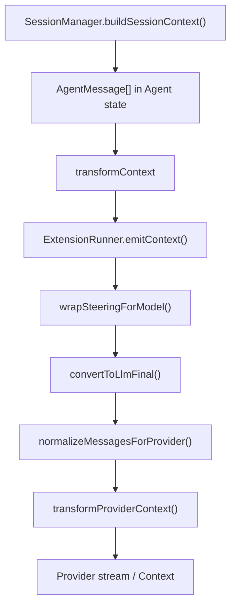

# H2: Host Context Event Pipeline — OMP 17.3.4 Extension Context for ICM

**Track:** H2 (`research/00-index.md`)  
**Date:** 2026-08-16  
**Host:** `docs/ref_repos/oh-my-pi-main` @ `de6b7974a0658e1fae8fac584368a33021ae668f` (17.3.4)  
**Scope:** Extension `context` event, `transformContext` wiring, `appendEntry`, compaction-adjacent events, `ExtensionAPI` / `ExtensionContext` surfaces relevant to Initiative Context Management (ICM). Research only — no product code.

---

## Executive summary

On OMP 17.3.4, the **only** path from session history to the LLM per turn is:

`SessionManager.buildSessionContext()` → in-memory `AgentMessage[]` → `transformContext` (`ExtensionRunner.emitContext` + host `wrapSteeringForModel`) → `convertToLlm` → `normalizeMessagesForProvider` → `transformProviderContext` (obfuscation, snapcompact inline, image clamp/normalize).

The `context` extension event exposes **`AgentMessage[]` deep copies with no `SessionEntry` id or provenance**. Handlers run **serially in extension load order** (extension array order, then handler registration order within each extension); each handler receives the **previous handler’s output**. There is **no priority argument** on `pi.on("context", …)`.

**Installed plugins load in stage 3** of discovery (after native auto-discovered modules and JS/TS hook factories). omp-qol as an installed plugin is **never first** in the global extension list unless also duplicated via an earlier discovery stage (deduped by absolute path).

`pi.appendEntry(customType, data)` persists a **`type: "custom"` session entry** via `SessionManager.appendCustomEntry`. These entries are **not emitted into model context** by `buildSessionContext` and are **not sent to the LLM** unless separately re-injected (e.g. via `sendMessage` / `custom_message`).

**Verdict on the five hypotheses:** all five are **confirmed** (not overturned) on 17.3.4, with nuance documented below.

---

## End-to-end pipeline



### Call site (agent loop)

In `packages/agent/src/agent-loop.ts`, `prepareProviderCall`:

1. `messages = await config.transformContext(messages, signal)` (if set)
2. `llmMessages = await config.convertToLlm(messages)`
3. `normalizedMessages = normalizeMessagesForProvider(llmMessages, model)`
4. Build `Context`, then optionally `transformProviderContext(llmContext, model)`

**`transformContext` always runs before both `convertToLlm` and provider normalization.**

### SDK wiring (main session)

`packages/coding-agent/src/sdk.ts` (inside `createAgentSession`):

```typescript
const transformContext = async (messages: AgentMessage[], _signal?: AbortSignal) => {
  const withContext = await extensionRunner.emitContext(messages);
  return wrapSteeringForModel(withContext);
};
```

- Subagents / auto-learn capture agents may use **`wrapSteeringForModel` only** (no extension context handlers) — see sdk.ts ~3770.
- **`HookRunner.emitContext` is not called on this path.** JS/TS hook factories discovered as extension modules use `ExtensionRunner` instead (`docs/extension-loading.md` §2).

### Session messages are not mutated

`packages/coding-agent/src/extensibility/shared-events.ts`:

> Original session messages are NOT modified — only the messages sent to the LLM are affected when a handler returns a replacement.

Persisted `session.jsonl` / agent state remain unchanged by `context` handlers; rewrites are **ephemeral per provider request** (unless the handler also writes session via other APIs).

---

## Hypothesis matrix

| # | Claim | Verdict | Evidence |
|---|--------|---------|----------|
| 1 | `context` exposes message copies only; no `SessionEntry` provenance/id | **Confirmed** | `ContextEvent.messages: AgentMessage[]`; `emitContext` uses `structuredClone(messages)` or shallow array copy; no entry ids on event or messages |
| 2 | Context handlers run serially; later handlers see earlier rewrites; no priority arg | **Confirmed** | `ExtensionRunner.emitContext` nested loops + `await`; `pi.on(event, handler)` appends to array; no priority parameter in `ExtensionAPI.on` |
| 3 | Installed plugin order is not guaranteed first | **Confirmed** | Discovery order: native → hooks → **plugins** → explicit CLI/settings; plugins never precede stages 1–2 |
| 4 | `pi.appendEntry` persists extension state; NOT sent to LLM | **Confirmed** | `appendCustomEntry` → `type: "custom"`; `buildSessionContext` does not map `custom` entries to messages; `docs/session.md` §`custom` |
| 5 | `transformContext` before `convertToLlm` / provider normalize | **Confirmed** | `prepareProviderCall` ordering; `transformProviderContext` runs after `convertToLlm` + `normalizeMessagesForProvider` |

---

## 1. Context event shape and provenance gap

### Type definitions

**Extension** (`packages/coding-agent/src/extensibility/shared-events.ts`):

```typescript
export interface ContextEvent {
  type: "context";
  /** Messages about to be sent to the LLM (deep copy, safe to modify) */
  messages: AgentMessage[];
}

export interface ContextEventResult {
  messages?: AgentMessage[];
}
```

**Hooks** (parallel API, `packages/coding-agent/src/extensibility/hooks/types.ts`) use the same event shape but `ContextEventResult.messages?: Message[]` (LLM wire type) — extensions use `AgentMessage[]` throughout.

### Clone semantics (`ExtensionRunner.emitContext`)

`packages/coding-agent/src/extensibility/extensions/runner.ts`:

- If no extension registered `context` handlers → **returns input unchanged** (no clone).
- Otherwise → `structuredClone(messages)`, falling back to `[...messages]` if clone fails (non-cloneable tool details, etc.).
- Handlers receive `event.messages` pointing at the **current chained array**; returning `{ messages: newArray }` replaces the chain for subsequent handlers.

### What is missing for ICM addressing

- No parallel array of `entryId`, `parentId`, or branch path.
- No stable handle tying an `AgentMessage` object identity back to journal rows after `replaceMessages` / compaction.
- **`session_before_compact`** exposes full provenance: `branchEntries: SessionEntry[]` plus `preparation` with entry ids (`firstKeptEntryId`, messages to summarize, etc.) — the right hook for **journal-aware** compaction/seal, not `context`.
- Side channel for ids during `context`: **`ctx.sessionManager.getBranch()`** returns `SessionEntry[]` on the active branch (includes `id`, `parentId`, `type`, `customType`, `data`). Correlating branch entries to `event.messages` requires **heuristic alignment** (order, timestamps, toolCallId, content hash) — not a host guarantee.

---

## 2. Handler ordering and chaining

### Extension runner algorithm

`ExtensionRunner.emitContext` (runner.ts ~1377–1420):

```
for (const ext of this.extensions) {           // load order
  for (const handler of ext.handlers.get("context") ?? []) {
    event = { type: "context", messages: currentMessages }
    result = await handler(event, ctx)           // serial, awaited
    if (result?.messages) currentMessages = result.messages
  }
}
```

Properties:

| Property | Behavior |
|----------|----------|
| Across extensions | **First loaded extension runs first**; last loaded runs last |
| Within one extension | **`pi.on` registration order** (handlers pushed to array) |
| Chaining | **Cumulative** — handler *n* sees output of *n−1* |
| Priority / weight | **None** |
| Parallelism | **None** (each handler awaited) |
| Timeout | `EXTENSION_HANDLER_TIMEOUT_MS` (30s default) per handler via `#runHandlerWithTimeout` |
| Errors | Logged + `emitError`; chain **continues** (failed handler’s return ignored) |
| Short-circuit | **No** — unlike `tool_call` block or `session_before_*` cancel |

Documented analog: `docs/hooks.md` §Runtime handler order lists **`context`: chained** for hooks; extension runner matches this for the unified extension pipeline.

Tests:

- `before_provider_request` chaining in load order: `packages/coding-agent/test/extensions-runner.test.ts` (“chains payload replacements across handlers in load order”) — same runner loop structure as `emitContext`.
- Context rewrite + append-only: `packages/coding-agent/test/agent-session-message-pipeline.test.ts` (~920) — extension `context` handler rewrites assistant text before provider call.

### `wrapSteeringForModel` runs after all extension handlers

Host applies steering envelope wrapping **after** `emitContext`, still inside `transformContext`. Extension handlers see **unwrapped** steering user messages; the model sees wrapped envelopes (`packages/coding-agent/src/session/messages.ts` `wrapSteeringForModel`).

---

## 3. Extension load order (why plugins are not “first”)

Authoritative doc: `docs/extension-loading.md` §Load order and precedence.

| Stage | Source |
|-------|--------|
| 1 | Native auto-discovered `.omp` extension modules |
| 2 | JS/TS hook factories (`.ts`/`.js` hook capability entries) |
| 3 | **Installed plugin** manifest entries (`getAllPluginExtensionPaths`) |
| 4 | Explicit paths: CLI `-e`/`--hook`, then settings `extensions` |

Dedup: first absolute path wins; later duplicates skipped.

Implementation: `discoverExtensionPaths` in `packages/coding-agent/src/extensibility/extensions/loader.ts`.

**Plugin internal order:** `getEnabledPlugins` merges user + project plugin roots (project shadows user by package name). Within a root, plugin names come from `Set` iteration over `package.json#dependencies` keys then lockfile keys (`collectPluginsAtRoot`) — **stable for a given install**, but **not “omp-qol first”** globally.

**Implication for ICM:** another native or hook extension’s `context` handler always runs **before** an installed omp-qol plugin unless omp-qol is also registered via stage 4 (explicit settings/CLI) **after** stage 3 entries — and even then, stages 1–2 still precede it.

Factory binding is **sequential in path order** after concurrent import (`loadExtensions` comment in loader.ts).

---

## 4. `pi.appendEntry` vs LLM-visible custom messages

### API contract

`ExtensionAPI.appendEntry` (`types.ts` ~1328):

> Append a custom entry to the session for state persistence (not sent to LLM).

Runtime wiring (`modes/runtime-init.ts`):

```typescript
appendEntry: (customType, data) => {
  session.sessionManager.appendCustomEntry(customType, data);
},
```

Persistence (`session-manager.ts` ~2188):

```typescript
appendCustomEntry(customType: string, data?: unknown): string {
  const entry: CustomEntry = { type: "custom", customType, data, ...this.#freshEntryFields() };
  this.#recordEntry(entry);
  return entry.id;
}
```

### Not the same as `custom_message` / `sendMessage`

| Mechanism | Session entry type | In `buildSessionContext` messages? | To LLM via `convertToLlm`? |
|-----------|-------------------|-----------------------------------|------------------------------|
| `pi.appendEntry` | `custom` | **No** (opaque journal) | **No** |
| `pi.sendMessage` / `appendCustomMessageEntry` | `custom_message` | **Yes** (→ `AgentMessage` role `custom`) | **Yes** (role-specific rules in `convertOne`) |

`docs/session.md` §`custom`: buildSessionContext does not turn `custom` entries into model messages; subsystem replay may consume known `customType` values.

**ICM pattern (documented in `docs/extensions.md` §Session and state patterns):**

1. Persist overlay state: `pi.appendEntry("com.omp-qol.icm.state", data)`
2. Rebuild on lifecycle: scan `ctx.sessionManager.getBranch()` for latest matching `custom` entry on `session_start` / branch / tree events
3. Apply overlay in **`context`** handler by rewriting the cloned `AgentMessage[]` (compress/pin/seal as ephemeral LLM view)

---

## 5. `transformContext` vs normalization (full boundary stack)

Order in `prepareProviderCall` (`agent-loop.ts` ~1514–1548):

| Step | Function | ICM relevance |
|------|----------|---------------|
| A | `transformContext` | Extension `context` + steering wrap — **ICM overlay belongs here** |
| B | `convertToLlm` | AgentMessage → provider `Message[]`; drops/filters by message role rules |
| C | `normalizeMessagesForProvider` | Provider-family message shaping |
| D | `transformProviderContext` | Obfuscation, snapcompact inline on system/tool frames, image clamp, **`normalizeProviderContextImagesForModel`** |

`sdk.ts` `convertToLlmFinal` also applies image blocking, provider replay filtering, secret obfuscation **after** extension context.

**ICM cannot rely on running after snapcompact inline imaging** without using `before_provider_request` or `transformProviderContext` (no extension hook for the latter — host config only).

---

## ExtensionAPI surface relevant to ICM

### Event subscriptions (ICM-critical)

| Event | Handler result | ICM use |
|-------|----------------|---------|
| `context` | `{ messages?: AgentMessage[] }` | Ephemeral compress / pin / seal on outbound context |
| `session_before_compact` | `{ cancel?, compaction? }` | Cancel or supply full `CompactionResult`; receives **`branchEntries: SessionEntry[]`** |
| `session.compacting` | `{ context?, prompt?, preserveData? }` | Augment summarizer prompt; **`preserveData`** stored on compaction entry |
| `session_compact` | (notification) | Post-compaction bookkeeping |
| `session_start` / `session_branch` / `session_tree` | — | Rehydrate state from `getBranch()` |
| `session_shutdown` | — | Teardown (2s handler timeout) |
| `before_agent_start` | `{ message?, systemPrompt? }` | Inject persisted custom messages / system prompt (not overlay on full history) |
| `before_provider_request` | replace payload | Last-resort wire-level mutation (after A–D above) |

Registration: `pi.on(event, handler)` — no overload with priority.

### Actions

| Method | ICM notes |
|--------|-----------|
| `pi.appendEntry(customType, data?)` | Durable ICM ledger / pin metadata (journal `custom`) |
| `pi.sendMessage` / `pi.sendUserMessage` | Inject LLM-visible content; different semantics from overlay |
| `pi.registerTool` | Expose ICM ops to model if desired |
| `pi.setLabel(entryId, label?)` | Transcript labels; uses `appendLabelChange` |
| `pi.compact(...)` via **`ctx.compact`** | Trigger host compaction from handler/command |
| `pi.events` | Cross-extension `EventBus` (optional coordination — not a ordering primitive) |

### `ExtensionContext` (handler `ctx`)

| Field / method | ICM notes |
|----------------|-----------|
| `sessionManager: ReadonlySessionManager` | See §Session manager access below |
| `getContextUsage()` | Pressure signals for overlay triggers |
| `compact(...)` | Host compaction entry point |
| `getSystemPrompt()` | Read effective system prompt (overlay usually targets messages, not this) |
| `models` | `list` / `current` / `resolve` / `family` — model-aware overlay |
| `memory` | Optional memory backend runtime |
| `setInterval` / `setTimeout` / `clearTimer` | Managed background timers (cleared on shutdown) |
| `invokeTool?` | Delegate to native built-in (17.2.2+) |
| `getAsyncJobSnapshot()` | Read async jobs (17.x) |
| `mode` | `"tui"` \| `"rpc"` \| `"json"` \| `"print"` — guard UI |
| `pi` | Full `@oh-my-pi/pi-coding-agent` exports (see below) |

### `ExtensionAPI.pi` (`typeof PiCodingAgent`)

Injected package namespace for SDK utilities. Examples in tree use `pi.pi` / registry patterns for **`AgentSession`** access beyond read-only `ctx.sessionManager`. **Not** a supported substitute for `buildSessionContext` on `ctx.sessionManager` — but omp-qol already reaches live session via registry (`plugin-seams.md`).

---

## Session manager access from extension `ctx`

### `ReadonlySessionManager` (what `ctx.sessionManager` actually is)

`session-manager.ts` ~327–350 — **Pick** includes:

`getCwd`, `getSessionDir`, `getSessionId`, `getSessionFile`, `getSessionName`, `getArtifactsDir`, `getArtifactManager`, `allocateArtifactPath`, `saveArtifact`, `getArtifactPath`, `getLeafId`, `getLeafEntry`, `getEntry`, `getLabel`, **`getBranch`**, **`getEntries`**, `getTree`, `getUsageStatistics`, `putBlob`, `putBlobSync`

**Not included:** `buildSessionContext`, `appendCustomEntry`, `appendMessage`, `rewriteEntries`, …

Writes go through **`pi.appendEntry`**, **`pi.sendMessage`**, **`pi.setLabel`**, not through `ctx.sessionManager`.

### Can a plugin call `buildSessionContext` from extension ctx?

| Path | Available? |
|------|------------|
| `ctx.sessionManager.buildSessionContext()` | **No** — not on `ReadonlySessionManager` |
| `ctx.sessionManager.getBranch()` | **Yes** — full branch entries with ids |
| `ctx.sessionManager.getEntries()` | **Yes** — all entries in session file |
| `ctx.sessionManager.getEntry(id)` | **Yes** — single entry lookup |
| Reconstruct messages manually from branch | Possible but **duplicates host logic** (compaction, reset_boundary, dangling tool pruning) — error-prone |
| `pi.pi` / `AgentRegistry` → live `AgentSession.sessionManager.buildSessionContext()` | **Possible** (omp-qol host-bridge pattern) — bypasses extension sandboxing intent; couples to registry |

**Recommendation for ICM:** use **`getBranch()`** for durable `(entryId, customType, data)` state; use **`context`** only for ephemeral LLM view; use **`session_before_compact`** when journal-aware compaction/seal must reference `SessionEntry` ids.

---

## Can QOL attach one `context` handler owning compress + pin ordering?

**Yes, internally; no, exclusively across extensions.**

Within **one** extension factory, a **single** `pi.on("context", …)` handler can apply pin-then-compress (or any fixed order) on the returned `messages` array — full control inside that function.

Across the process:

- **Cannot** prevent other extensions’ handlers from running before/after unless you control global load order.
- **Cannot** register priority or “last writer wins” for `context` (unlike `session.compacting` where **last handler’s result wins** inside `emit()` for that event type only).
- **Mitigations:**
  1. Register omp-qol via **explicit settings/CLI path** so it loads **after** other plugins (still after native/hooks).
  2. Consolidate ICM into **one** extension module (single handler).
  3. Use **`session_before_compact`** + `preserveData` for seal/compaction coordination (journal-aware).
  4. Coordinate via **`pi.events`** (soft — no ordering guarantee).

**Compress vs pin ordering across hooks:** `session.compacting` and `context` are different phases — compaction summarization uses `session.compacting` + LLM; `context` runs every provider call. ICM “compress overlay” in `context` is orthogonal to host `/compact` unless explicitly synchronized via shared `appendEntry` state.

---

## Legacy hooks vs extensions (context path)

| System | `context` on main agent LLM path? |
|--------|-----------------------------------|
| **ExtensionRunner** (`emitContext`) | **Yes** — wired in `sdk.ts` `transformContext` |
| **HookRunner** (`emitContext`) | **Implemented** but **not** called from `sdk.ts` / agent loop for transformContext |
| JS/TS hooks loaded as extension modules | Handlers run on **ExtensionRunner** |

Hooks documentation (`docs/hooks.md`) still describes hook `context` chaining for hook authors; main-session LLM prep uses extensions.

---

## New or clarified 17.3.x APIs (post ~2026-08-09 research baseline)

Items likely **missing or under-specified** in early August ICM research against 17.2.x / pre-17.3 hosts:

| API / behavior | Version / note | ICM relevance |
|----------------|----------------|---------------|
| `ctx.mode` (`ExtensionMode`) | 17.3.x fix: contexts expose runtime mode | Guard TUI-only ICM diagnostics |
| `ctx.models` (`ExtensionModelQuery`) | 17.3+ | Model-family-aware overlay without registry hacks |
| `ctx.getAsyncJobSnapshot()` | Pre-17.3 changelog | Avoid pinning async job noise |
| `ctx.invokeTool()` | 17.2.2 | Native tool delegation from ICM wrapper tools |
| Managed `ctx.setInterval` / `setTimeout` | 17.x (#5664) | Safe periodic overlay refresh |
| `session_stop` + continuation (`continue`, `additionalContext`, 8-cap) | 17.x | Stop-hook context injection — separate from `context` |
| `mcp_notification` event + startup buffer | 17.x | Unrelated to ICM unless bridging external pin signals |
| `CompactOptions.internalGuidance` | 17.x (#4359) | Plan-mode compaction — not visible as `customInstructions` on `session_before_compact` |
| `credential_disabled` event | 17.x | Auth lifecycle |
| `after_provider_response` | Extension surface | Telemetry only (no payload rewrite) |
| `message_end` explicit “detached snapshot — in-place edits don’t rewrite context” | types.ts | Reinforces: use `context` / `tool_result` for provider rewrites |
| Extension load: concurrent import, **sequential bind** | loader.ts | Order deterministic at bind time |
| Subagent `transformContext`: steering wrap only | sdk.ts ~3770 | Subagents **skip** extension `context` handlers |

17.3.4 itself is primarily PDF/MCP/Gemini fixes (`CHANGELOG.md`) — **no material change** to the context pipeline vs 17.3.0.

---

## ICM design implications (concise)

1. **Addressing:** Treat `context` as **content-level** rewrite; persist `(sessionId, entryId)` in `appendEntry` + `getBranch()`; use **`session_before_compact.branchEntries`** for compaction/seal that must reference journal rows.
2. **Ordering:** Assume **native → hooks → plugins → explicit** handler order; design single-handler ICM or accept composability with unknown third-party `context` handlers.
3. **Durability vs visibility:** `appendEntry` for ICM state; **`context`** for per-request LLM view; never assume `custom` entries appear in `event.messages`.
4. **Host compaction:** Coordinate with `session_before_compact` / `session.compacting` / `preserveData` rather than reimplementing host compaction in `context` alone.
5. **Provenance gap:** Plan for **correlation layer** (message index ↔ branch walk) or registry access to `buildSessionContext()` if strict alignment is required — not provided by the event.

---

## Primary source index

| Topic | Path |
|-------|------|
| Context event types | `packages/coding-agent/src/extensibility/shared-events.ts` |
| Extension API types | `packages/coding-agent/src/extensibility/extensions/types.ts` |
| `emitContext` / handler loop | `packages/coding-agent/src/extensibility/extensions/runner.ts` |
| Load order | `packages/coding-agent/src/extensibility/extensions/loader.ts`, `docs/extension-loading.md` |
| Plugin paths order | `packages/coding-agent/src/extensibility/plugins/loader.ts` (`getAllPluginExtensionPaths`) |
| SDK transformContext | `packages/coding-agent/src/sdk.ts` (~3107–3110, ~3209–3216) |
| Agent loop ordering | `packages/agent/src/agent-loop.ts` (`prepareProviderCall`) |
| convertToLlm | `packages/coding-agent/src/session/messages.ts` |
| buildSessionContext / custom entries | `packages/coding-agent/src/session/session-context.ts`, `docs/session.md` |
| appendEntry wiring | `packages/coding-agent/src/modes/runtime-init.ts`, `session-manager.ts` |
| Extension author docs | `docs/extensions.md`, `docs/hooks.md` (hook order analog) |
| Compaction events | `packages/coding-agent/src/session/session-maintenance.ts` |
| Tests | `packages/coding-agent/test/extensions-runner.test.ts`, `agent-session-message-pipeline.test.ts` |

---

## Related omp-qol research

- `research/plugin-seams.md` — current plugin does not register `context`; reaches live session via registry
- `research/00-index.md` — H4 (`host-addressing.md`) for entry-id correlation; H1 for compaction hooks
