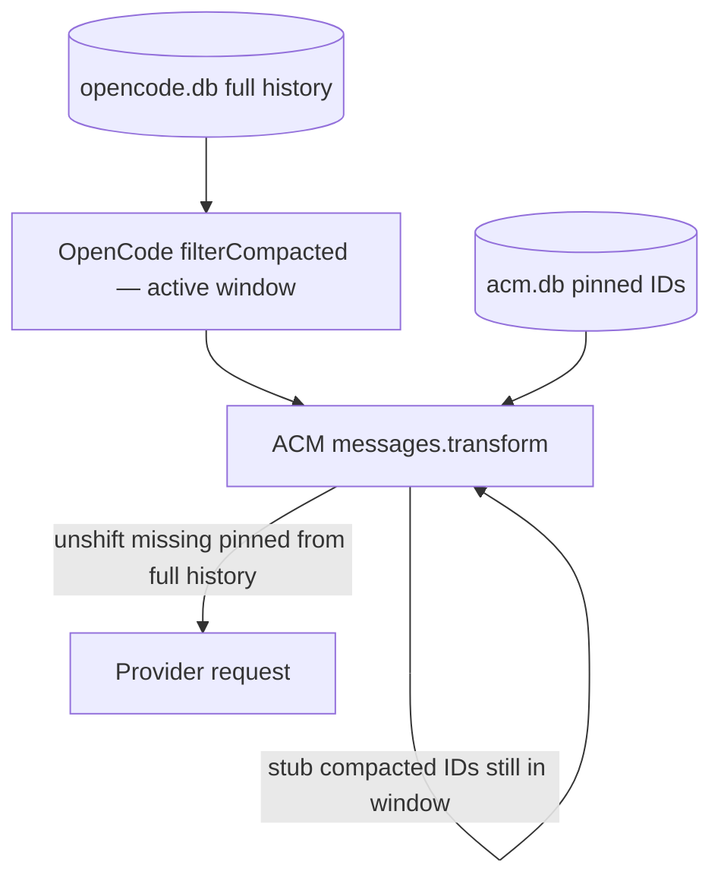

# D3: opencode-acm — Pin + Compact Neighbor Product

**Track:** D3 (`research/00-index.md`)  
**Upstream:** [rickross/opencode-acm](https://github.com/rickross/opencode-acm)  
**Local clone:** `docs/ref_repos/opencode-acm`  
**HEAD commit:** `6ca26461bc69248c68cb50f34cbe65ece6b72ff4` — *v0.5.57: SDK 1.17.14, trust-check ctx.directory before reading it* (2026-07-07)  
**Package version:** 0.5.57 (`package.json`)  
**Host target:** OpenCode 1.3.x+ (`README.md`); SDK pinned to `@opencode-ai/plugin` / `@opencode-ai/sdk` **1.17.14**

---

## Executive summary

**opencode-acm (ACM)** is an OpenCode plugin that gives agents explicit tools to **pin**, **prune** (per-message hide), **compact** (sliding-window boundary), and **load knowledge packages** (named file/inline loads). It is a practical, production-shaped neighbor to OMP-QOL initiative-context-management — but it solves a *different* persistence and compression contract than QOL pillars require.

| Dimension | ACM | OMP-QOL (ICM pillars + invariants) |
|---|---|---|
| Canonical journal | OpenCode `opencode.db`; ACM adds rows and sometimes deletes/repairs | Lossless `SessionEntry` journal; overlay is append-only custom entries |
| Compression | Fixed stub string + optional native boundary marker | Agent-authored summarize/expand at any time |
| Pin semantics | Metadata flag + full message re-injection at list **head** | Salience intent; bottom pin zone / cache-aware placement still open |
| State store | Separate SQLite `acm.db` sidecar with upsert | No sidecar DB; tombstones/overlays via `appendEntry` |
| Host hooks | `experimental.chat.messages.transform` (+ system transform, event) | `context` event, `session_before_compact`, `appendEntry` |

ACM is valuable as **evidence of working seams** (transform projection, native compaction markers, active-window filtering, inspection tooling) and as a **counterexample** for storage, reversibility, and pin rendering choices QOL must re-derive on OMP.

---

## 1. Pin model: what can be pinned, how IDs work, where pins live

### 1.1 What can be pinned

ACM pins at **message granularity** — any row in OpenCode's message store, regardless of role or part mix:

- User commands, assistant replies, tool-result-bearing messages, MKP loads (`acm_load`), etc.
- No part-level or range-level pin; the whole message is the unit of salience.
- **MKP default:** `acm_load` pins by default (`pin: true`); `acm_unload` unpins + marks compacted (`src/tools.ts` `acm_load`, `acm_unload`).
- **Prune immunity:** `compactMessage()` in `src/store.ts` uses `CASE WHEN pinned = 1 THEN 0 ELSE 1` — pinned messages cannot be pruned/stubbed via metadata.

Tools: `acm_pin`, `acm_unpin`, `acm_mark` (batch), MKP lifecycle via `setMkp` / `unloadMkp`.

### 1.2 How IDs work

| Layer | Identity |
|---|---|
| Primary key | OpenCode message `info.id` (e.g. `msg_…`, `msg_acm_compact_…`) |
| Sidecar key | `(session_id, message_id)` in `acm_metadata` |
| Resolution | `findMsg()` in `src/tools.ts`: exact match → `endsWith(partial)` → `includes(partial)` |
| Discovery | `acm_pin.search_string` (substring scan), `acm_search` (full history), MKP by `mkp_name` |

**Caveat:** Docs say "last 12 chars" convenience, but `includes()` is broader and can be ambiguous (`src/tools.ts` L24–26).

Timestamps (`info.time.created`) drive compact windows only; they are not pin addresses.

### 1.3 Where pins live

Pins do **not** live in OpenCode's canonical message JSON. They live in a **separate SQLite sidecar**:

- Path: `~/.local/share/opencode/acm.db` (or `OPENCODE_DATA_DIR`) — `src/store.ts` L13–14, L44–64
- Table: `acm_metadata(message_id, session_id, pinned, compacted, mkp_name, created_at, updated_at)`
- Writes: `INSERT … ON CONFLICT DO UPDATE` — **mutable upsert**, not append-only (`src/store.ts` L89–106, L108–115)

Canonical message bodies remain full-fidelity in `opencode.db`. Pin state is orthogonal metadata keyed by message ID.

---

## 2. Does pin re-inject after compaction? (system vs tail vs marker)

**Yes — but only for boundary compaction, and only at the active-window head (not system, not tail).**

### 2.1 Three placement mechanisms in ACM (do not conflate)

| Mechanism | Where injected | Purpose | Source |
|---|---|---|---|
| **Pinned re-injection** | **Head** of transformed message list (`unshift`) | Restore pinned messages dropped by compaction boundary | `src/index.ts` L179–201 |
| **Runtime telemetry** | Synthetic message **before last user message** | Context budget / clock hint (default on) | `src/index.ts` L305–390 |
| **Heartbeat** | Appended to **last user text part** | Timestamp line (opt-in) | `src/index.ts` L207–303 |

Pin survival uses **only** the first row. It is **not** system-prompt pin (`experimental.chat.system.transform` only strips stale telemetry and caches model limit — `src/index.ts` L396–417). It is **not** tail/bottom pin zone as described in `InitiativePin.md`.

### 2.2 Re-injection algorithm (after boundary compact)



1. OpenCode's `filterCompacted` excludes messages before the latest completed compaction boundary (`src/client.ts` L117–160 replicates this in `getActiveMessages`).
2. Transform loads `Store.getPinnedMessages(sessionID)` (`src/store.ts` L144–148).
3. For each pinned ID **not present** in the active list, fetch full message from `getMessages()` (reads `opencode.db` — `src/client.ts` L105–115).
4. Wrap with synthetic banner part `[Pinned context re-injected by ACM]` and `output.messages.unshift(...wrapped)` (`src/index.ts` L191–198).

**Not used:** OpenCode native post-compaction pin markers (e.g. PR #9097 territory). Pins are entirely ACM-owned metadata + projection.

### 2.3 Interaction with prune vs boundary

| Event | Pinned behavior |
|---|---|
| **`acm_prune`** (surgical) | Skipped if pinned (`src/tools.ts` L504–505); stays in active window, never stubbed |
| **`acm_compact`** (boundary) | Pre-boundary pinned messages drop from active window → **re-injected at head** next turn |
| **In-window pinned** | Never get `compacted=1` metadata; never stubbed in transform loop (`src/index.ts` L145–177 guarded by `getCompactedMessages` which excludes pinned — `src/store.ts` L151–155) |

**QOL tension:** Pillar `InitiativePin.md` favors a **bottom pin zone** for cache economics. ACM trades that for transform-hook simplicity (head `unshift`).

---

## 3. Compact / prune tools vs native OpenCode compaction

ACM implements **two orthogonal compaction modes** plus alignment with OpenCode's native boundary format.

### 3.1 Surgical prune (`acm_prune`, `acm_mark`, `acm_unload`, `acm_prune_noops`)

| Aspect | Behavior |
|---|---|
| **Scope** | Per-message; does **not** move global compaction boundary |
| **Storage** | `acm_metadata.compacted = 1` (unless pinned) — `src/store.ts` L125–134 |
| **Wire effect** | On next turn, transform replaces text/tool output with fixed stub `[Old tool result content cleared]` — `src/index.ts` L38, L145–177 |
| **Reversible to model?** | **No** structured expand; full content still in `opencode.db`, reachable via `acm_fetch` / `acm_search` |
| **Safety** | Skips messages with `thinking` / `redacted_thinking` parts (`src/index.ts` L146–156) |

This is **hide-from-model**, not InitiativeSummary-style agent-authored compression.

### 3.2 Boundary compact (`acm_compact`)

| Aspect | Behavior |
|---|---|
| **Scope** | Moves **compaction boundary** — everything before cutoff leaves active window |
| **Strategies** | `keep_active_minutes` (chess clock + gap threshold), `keep_minutes`, `keep_messages`; `dry_run` / `preview` — `src/tools.ts` L388–463 |
| **Mechanism** | Inserts **OpenCode-native marker pair** into `opencode.db` via `Store.insertCompactionMarker()` — `src/store.ts` L400–523 |
| **Marker shape** | (1) User message with `type: "compaction"` part (`auto: false`); (2) Assistant with `summary: true`, `parentID` → user marker, minimal step parts — same comment block L403–408 |
| **Housekeeping** | Deletes prior `msg_acm_compact_*` / `msg_acm_summary_*` for session before insert — only one ACM boundary at a time (L423–430) |
| **Summary content** | **Empty shell** — no agent-authored summary text in the assistant message |

`getActiveMessages()` (`src/client.ts` L127–160) walks full history, finds the **last** user message with a `compaction` part whose ID is referenced by a completed `summary: true` assistant — then returns everything **after** that index. OpenCode host filtering and ACM tools therefore **agree on active context** when markers match native shape.

### 3.3 vs native OpenCode compaction

| | Native OpenCode compaction | ACM `acm_compact` | ACM `acm_prune` |
|---|---|---|---|
| Moves boundary | Yes | Yes (inserts native-shaped pair) | No |
| Agent-initiated | Host-triggered + optional tools | Yes | Yes |
| Summary text | Host LLM summary (when used) | None (shell assistant) | N/A (stub only) |
| Storage mutation | Host journal | **Direct SQLite INSERT/DELETE** on `opencode.db` | Sidecar metadata only |
| Pinned old messages | Dropped from active window | Same — rely on ACM re-injection | N/A if still in window |

ACM does **not** hook OpenCode's compaction pipeline; it **writes the same marker shape** the host already understands and layers prune metadata + transform stubbing on top.

---

## 4. Agent-facing tool list and UX

### 4.1 Registered tools (17)

From `src/index.ts` L86–103:

```
acm_pin, acm_unpin, acm_info, acm_compact, acm_prune, acm_prune_noops,
acm_scan, acm_load, acm_unload, acm_mark, acm_search, acm_fetch,
acm_map, acm_snapshot, acm_diagnose, acm_repair
```

**No unified multi-op tool** (e.g. no `acm_manage({ op: … })`). Overlap is intentional: `acm_mark` batches pin+prune; `acm_pin` with no args lists pins.

### 4.2 UX patterns

| Category | Tools | Agent loop role |
|---|---|---|
| **Status** | `acm_info` | Version, token estimate, structural breakdown, telemetry flag (`src/tools.ts` L158+) |
| **Pin** | `acm_pin`, `acm_unpin`, `acm_mark` | Mark bedrock context |
| **Measure** | `acm_scan`, `acm_map` | Size-sorted list; time-bucket distribution (`src/tools.ts` L714+, L1051+) |
| **Target** | `acm_search`, `acm_fetch` | Full-history "wayback" (`acm_search` description L949–958) |
| **Act** | `acm_prune`, `acm_compact`, `acm_load`/`unload` | Surgical hide or boundary move |
| **Housekeeping** | `acm_diagnose`, `acm_repair`, `acm_snapshot` | Session health, raw DB repair, JSON dump |

**Streaming:** All tools wrapped with `streaming()` — output pushed to TUI via `ctx.metadata({ metadata: { output } })` (`src/index.ts` L27–36).

**Workflow (README):** `acm_info` → `acm_scan` → `acm_prune` / `acm_pin` → verify — documented in `README.md` L69–110.

**Domain-specific optional:** `acm_prune_noops` — hard-coded pacemaker idle-opportunity pair detector (`src/tools.ts` L592–618); agent opt-in, not core policy.

**Default plugin policy (tension):** Runtime telemetry injects `<runtime-telemetry>` every turn unless disabled (`src/index.ts` L61–68, L305–390) — not agent-initiated.

### 4.3 Hooks (4)

`package.json` L32–37 / `src/index.ts`:

1. `tool` — register tools  
2. `experimental.chat.messages.transform` — stub, reinject, telemetry, heartbeat, system-reminder strip  
3. `experimental.chat.system.transform` — strip stale telemetry; cache model limit  
4. `event` — finalize MKP pin queue on `session.updated` (`src/index.ts` L422–437)

---

## 5. Persistence / session repair

### 5.1 Two storage layers

| Store | Path | ACM usage |
|---|---|---|
| **`opencode.db`** | Host session journal | Read via `readMessagesFromStore` (`src/client.ts` L49–97); **mutated** for compaction markers, repair, deletes |
| **`acm.db`** | Sidecar metadata | Pin/prune/MKP flags; upsert semantics |

Pin/prune metadata is **never written into message rows** — only the sidecar.

### 5.2 Canonical mutations (lossless-journal tension)

| Operation | Touches `opencode.db`? | Notes |
|---|---|---|
| `acm_pin` / `acm_prune` | No (metadata only) | Tool results become normal new messages via OpenCode |
| `acm_compact` | **INSERT** marker pair; **DELETE** old ACM markers | `src/store.ts` L423–430 |
| `acm_repair` | **INSERT** assistant pairs, **DELETE** ghosts, **UPDATE** stuck parts | `insertAssistantPairForUser`, `deleteRawMessage`, `fixStuckParts` |
| `deleteRawMessage` | **DELETE** message + parts | `src/store.ts` L199–215 |

`acm_diagnose` scans for orphaned users, empty assistants, stuck tools (`src/tools.ts` L1217–1300). `acm_repair` defaults `dry_run: true`; can insert minimal assistant child for orphaned user messages to fix TUI QUEUED state (`src/tools.ts` L1306–1390).

### 5.3 Projection-only mutations

`experimental.chat.messages.transform` mutates the **in-memory outbound list** for one request: stubs, reinjection copies, telemetry splice, heartbeat append, system-reminder strip. Original DB rows for pruned messages stay intact until explicit delete/repair.

### 5.4 MKP async pin

`acm_load` queues `{ name, messageId: ctx.messageID }` in `pendingMkp`; `event` handler on `session.updated` calls `Store.setMkp()` (`src/tools.ts` L853–865, L864–865; `src/index.ts` L422–437). Pins the **tool-result message** created by the load call, not a separate storage tier.

---

## 6. What maps cleanly onto OMP — and what does not

Reference OMP seams (from `research/plugin-seams.md`, `research/host-compaction.md`, `INVARIANTS.md`):

| OMP seam | ACM analog | Fit |
|---|---|---|
| **`pi.on("context")` projection** | `experimental.chat.messages.transform` | **Pattern maps** — return modified message list for provider. OMP `context` event is documented as cleaner (replacement array, no runtime message touch). ACM proves transform-only projection works in production on OpenCode. |
| **`appendEntry` overlay persistence** | `acm.db` upsert sidecar | **Does not map** — violates invariant #6 (append-only custom entries). QOL should use `(sessionId, entryId)`-keyed pin/tombstone/summary records via `pi.appendEntry(customType, …)`. |
| **`CompactionEntry` / `session_before_compact`** | `insertCompactionMarker` direct SQLite | **Partial pattern, wrong seam** — ACM aligns on **marker semantics** host filtering understands, but writes raw SQL instead of append-only `CompactionEntry` + `firstKeptEntryId`. OMP can seal via custom `CompactionResult` without second LLM (`host-compaction.md` claim 3). ACM never uses `session_before_compact`. |
| **`getActiveMessages` / boundary math** | `getActiveMessages` in `src/client.ts` | **Steal algorithm** — replicate host `filterCompacted`; re-verify on OMP 17.3.4 (H1). |
| **Agent-initiated pin/unpin** | `acm_pin`, `acm_unpin`, `acm_mark` | **Strong** — no auto-pin heuristics except MKP default `pin: true`. |
| **Dual compact model** | `acm_compact` vs `acm_prune` | **Strong** — boundary vs surgical hide is the right conceptual split for ICM. |
| **Inspection toolchain** | `acm_info`, `acm_scan`, `acm_map`, `acm_search`, `acm_fetch` | **Strong UX pattern** — measure → target → act → verify on stable IDs. |
| **InitiativeSummary** | `COMPACTED_STUB` + empty boundary assistant | **Reject** — fixed stub, no expand API, no agent-authored summary content. |
| **InitiativePin salience rendering** | Full message replay at head | **Tension** — invariant #9: pin is intent, not raw replay; pillar prefers bottom pin zone (invariant #11 cache frontier). |
| **Lossless journal (#5)** | DELETE/UPDATE on `opencode.db` | **Reject** for QOL canonical store; repair may remain host-scoped outside ICM core. |
| **Entry identity (#7)** | Message `id` only | **Partial** — aligns on stable IDs, but no `(sessionId, entryId)` overlay provenance or branch replay. |
| **Transform-only headroom (#12)** | Assumes transform sufficient | **Re-verify on OMP** — ACM on OpenCode ≠ OMP native headroom claim. |

### 6.1 Suggested OMP port sketch (conceptual, not product code)

```text
Agent tool (pin/prune/compact/list)
  → appendEntry("com.omp-qol.icm-pin" | "…-tombstone" | "…-summary", data)
  → reducer on pi.on("context") builds wire list from journal + overlay
Boundary move:
  → prefer session_before_compact custom CompactionResult OR append CompactionEntry-compatible intent
  → avoid raw SQLite like ACM insertCompactionMarker
Pin survival after boundary:
  → projection policy (bottom zone / salience text) — technique from ACM re-injection, not head-unshift default
```

---

## 7. Lessons for InitiativePin vs PinStateTree

ACM is a **flat pin set**, not a tree. This section separates what it teaches each pillar.

### 7.1 InitiativePin

| Pillar intent | ACM evidence | Lesson |
|---|---|---|
| Any message may be pinned | Message-level pin for all roles; MKP loads | **Validates** freedom scope — pin target = whole session message |
| Agent pin/unpin freedom | Explicit tools; list mode on `acm_pin` | **Adopt** verb-per-tool or thin multi-op; avoid auto-pin policy |
| Bottom pin zone / cache | Head `unshift` reinjection | **Do not copy** as default — ACM chose simplicity over `InitiativePin.md` cache economics |
| Pin affects summary | Not implemented | **Gap** — ACM survives via replay, not summary policy |
| Pin as salience intent | Full parts replayed including tool states | **Tension** — QOL should project provider-neutral pin content (invariant #9) |
| Named reference loads | MKP `mkp_name` + default pin | **Steal pattern** — stable name for unload/list, mapped to overlay metadata |

**Takeaway:** ACM is the best nearby proof that **agent-driven message pins + boundary survival** work in production, but its **placement and rendering** differ from the pillar's preferred shape.

### 7.2 PinStateTree

| Pillar intent | ACM |
|---|---|
| Trees select pin state by ancestor path | **None** |
| One active leaf per tree; march/jump | **None** |
| Leaf pins messages or custom instructions | **None** — only flat `pinned=1` rows |
| Display path + siblings | **None** |

**Verdict:** PinStateTree has **zero ACM equivalent**. Do not infer tree semantics from ACM. Trees remain QOL-only control plane downstream of a flat Pin API (invariant #10: PinStateTree depends on Pin; Pin must not depend on PinStateTree).

ACM's flat model is a **floor**, not a ceiling: QOL Pin API should look like ACM's pin/unpin/list ergonomics; PinStateTree layers workflow-scoped pin **sets** on top without ACM precedent.

---

## 8. Architecture map (source files)

```
docs/ref_repos/opencode-acm/
├── src/index.ts      # Hooks: transform, system, event; tool registry; reinject + stub
├── src/tools.ts      # 17 tool executors; findMsg; MKP queue
├── src/store.ts      # acm.db + opencode.db writes (markers, repair)
├── src/client.ts     # getMessages, getActiveMessages, SQLite hydrate
├── README.md         # User-facing product docs
└── aurora-review.md  # Internal review notes (hook count, test gaps)
```

**Testing:** `client.selftest.ts` only (hydrate / summary boolean normalization). No integration tests for pin/reinject/compaction (`aurora-review.md`).

---

## 9. Steal vs reject (QOL checklist)

### Steal

1. Dual compaction: boundary vs surgical hide  
2. `getActiveMessages` / `filterCompacted` replication  
3. Inspection trio: scan + map + info + search/fetch  
4. Pin survival via off-window re-injection (with explicit placement policy)  
5. MKP naming for reference loads  
6. Thinking-block mutation guards  
7. Chess-clock `computeActiveCutoff` as optional compact strategy  
8. Direct store read fallback when SDK schema lags (`readMessagesFromStore`)  
9. Native-compatible boundary marker **shape** (not raw-SQL write path)  
10. Discrete agent verbs — compression stays agent-initiated  

### Reject

1. Sidecar `acm.db` upsert  
2. Fixed stub as "compression"  
3. No structured expand  
4. Canonical DB DELETE for markers/repair (for ICM core)  
5. Head reinject as default pin render  
6. Raw message replay for pins  
7. Default-on silent telemetry  
8. `includes()` partial ID matching without ambiguity errors  
9. PinStateTree inference from ACM  
10. Transform-only assumption on OMP without H1 re-verify  

---

## 10. Open questions (follow-up tracks)

1. **H1:** Does OMP 17.3.4 expose the same compaction boundary semantics? Can QOL append boundary intents via `CompactionEntry` / `session_before_compact` without SQLite?  
2. **H2:** Map ACM transform behaviors onto `context` event handler ordering and provenance gap.  
3. **H3:** Cache impact: bottom pin zone vs ACM head reinjection.  
4. **D4:** ACM reinjection vs OpenCode native pin-after-compaction — redundant or complementary?  
5. **E1:** Replace ACM's heuristic ~4 chars/token in `acm_info` with measured first-divergence reporting.  

---

## 11. References

- Local source: `docs/ref_repos/opencode-acm/` @ `6ca26461bc69248c68cb50f34cbe65ece6b72ff4`  
- Pillars: `docs/ssot/pillars/initiative-context-management/{InitiativePin,InitiativeSummary,PinStateTree}.md`  
- Invariants: `docs/workspaces/initiative-context-management/INVARIANTS.md`  
- OMP seams: `docs/workspaces/initiative-context-management/research/plugin-seams.md`  
- Host compaction: `docs/workspaces/initiative-context-management/research/host-compaction.md`  
- Internal review: `docs/ref_repos/opencode-acm/aurora-review.md`
